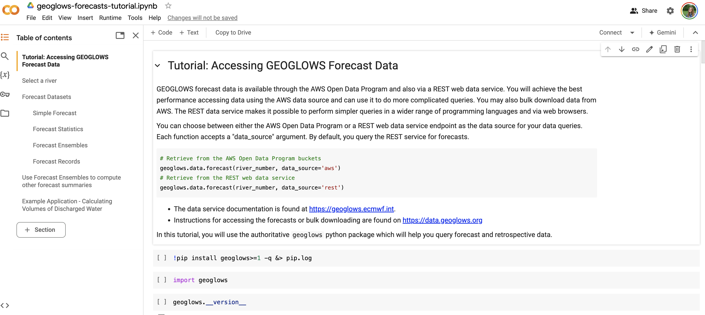

# Bulk Data Download

This Colab Notebook defines the process for downloading data from AWS.

[Forecast Data](https://colab.research.google.com/drive/1tOuybiHK3HuxwL0MHDhGRbU65-yaolGs?usp=sharing)

Most GEOGLOWS data can be downloaded from the web browser. Links to these datasets are given at the [Available Data](https://data.geoglows.org/available-data) page.

## Forecast Data
New 15 day forecasts are produced each day and made available immediately via a [web data service](https://geoglows.ecmwf.int) as well as on an AWS S3 bucket. The CLI command pattern for downloading forecast datasets is:

## Retrospective Data
The retrospective simulation datasets are organized by computational groups (VPUs). Please review the tutorial on [Finding River Numbers](https://data.geoglows.org/tutorials/finding-river-numbers) for help identifying streams and VPU numbers. The CLI command pattern to use for downloading this data is:

aws s3 cp s3://geoglows-v2-retrospective/retrospective/<vpu-number-here> </local/save/path> --recursive --no-sign-request

Follow along with a tutorial notebook here: 
[Retrospective Data from NetCDFs](https://colab.research.google.com/drive/1jU915e-OrSnawi_OJkEH7gj4Pznu4qzu?usp=share_link)