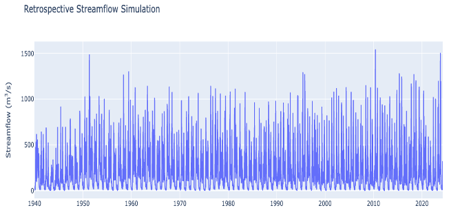

# Derivation

The following presentation shows the method of derivation for 
GEOGloWS Data: 

[Retrospective Data](https://byu.sharepoint.com/:p:/r/sites/BYUHydroinformaticsLaboratory/Shared%20Documents/geoglows-training/GEOGLOWS%20Master%20Training%20Materials/Retrospective%20Validation/ERA5_time%20period_%20updates%20Updated.pptx?d=w28f09b16fbaf401588190b4ce215cfd9&csf=1&web=1&e=Vk5j14)

This tutorial will guide you through the process of retrieving and manipulating retrospective simulation results for a specific river using the GEOGLOWS Hydrological Model. 

[Retrospective Colab Notebook](https://colab.research.google.com/drive/1DEqWPDbIgs21N-Q4AOQC4bAdZN1PQt54#scrollTo=kN_2TS4gbTZl)