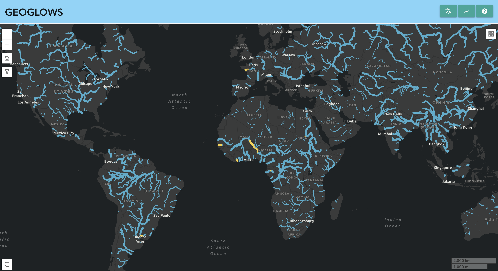

# Accessing Data

## Hydrofabric

## Hydroviewer App
The Hydroviewer App is a web-based tool designed to visualize and interact with streamflow data.

The following presentation outlines the method for using the
Hydroviewer. 

[Hydroviewer Tutorial](https://byu.sharepoint.com/:p:/r/sites/BYUHydroinformaticsLaboratory/Shared%20Documents/geoglows-training/GEOGLOWS%20Master%20Training%20Materials/Accessing%20GEOGLOWS%20Data/GEOGloWS%20Hydroviewer%20Tutorial%20.pptx?d=w85886b618747498999f74dac596a7f47&csf=1&web=1&e=IusrWy)

### Features:

* <b>Interactive Map:</b> View animated streamflow forecasts overlaid on a map. (ESRI Dynamic Mapping Service [invalid URL removed])
* <b>Data Retrieval:</b> Extract streamflow data for specific river segments.
* <b>Streamflow Calibration:</b> Fine-tune streamflow forecasts by incorporating measured discharge data from national gauging networks.
* <b>Data Exploration:</b> Analyze historical and forecasted streamflow trends.

### Benefits:

* <b>Visualize Streamflow Forecasts:</b> Gain a clear understanding of predicted streamflow patterns across regions.
* <b>Access Streamflow Data:</b> Easily retrieve data for specific locations.
* <b>Improve Forecast Accuracy:</b> Calibrate forecasts using real-world observations.
* <b>Support Water Resource Management:</b> Inform decisions related to water allocation, flood preparedness, and drought mitigation.

### Target Users:

* Hydrologists
* Water resource managers
* Researchers
* Anyone interested in streamflow forecasting

### Note:

This application is developed by the BYU Hydroinformatics Lab and this text was generated in part by AI.

## Programmatic Access

GEOGLOWS Data can be accessed through the use of an API at [this link][1]

The following presentation outlines the process of using the web browser interface to access data, as well as briefly outlines the 
method of using the geoglows python package to do the same thing. 

[Programmatic Access][2]

This [Google Collab][3] notebook holds the code to access geoglows data. 

[1]: https://geoglows.ecmwf.int/documentation#/default/get_dates
[2]: https://byu.sharepoint.com/:p:/r/sites/BYUHydroinformaticsLaboratory/Shared%20Documents/geoglows-training/GEOGLOWS%20Master%20Training%20Materials/Accessing%20GEOGLOWS%20Data/Programmatic%20Access%202.0.pptx?d=wb82414d8ae2640f0bb2bcb790a966b6d&csf=1&web=1&e=06SVks
[3]: https://colab.research.google.com/drive/13k9N87nwiA3GL0wYp4zNxIdj-lho0NLE

