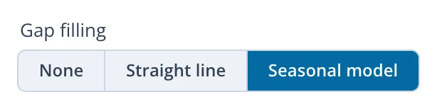
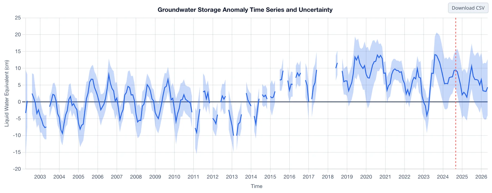
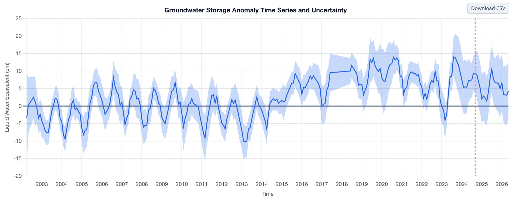
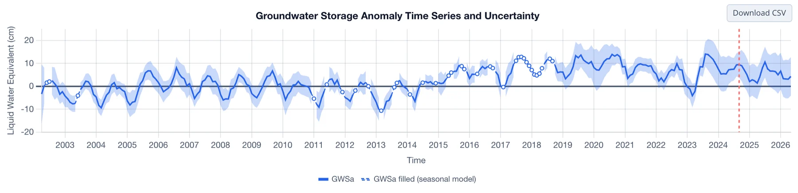

# Gap Filling

The GRACE record is missing 35 months: scattered single months, mostly between 2011 and 2017, and the 11 months between the end of GRACE and
the start of GRACE-FO (see [The GRACE Mission](../background/grace-mission.md#the-record-and-its-gaps)). The **Gap filling** control in the
panel sets what the chart does at those months:

{ width="310" }

- **None** breaks the line at every gap, so you can see exactly which months were observed.
- **Straight line** joins the months on either side of each gap. It only bridges the gap on the chart and estimates nothing.
- **Seasonal model** estimates each missing month from a trend and seasonal cycle fitted to the observed months. Filled months are drawn as a
  dashed line with open markers, and hovering over one shows its value. This option also adds the **Recharge Analysis** button above the
  chart (see [Opening the Analysis](../recharge/opening.md)).

The Northern Midwest Aquifer System, which has a strong seasonal cycle, shows the difference between the three options. With **None**:

With **Straight line**, the 11 months between the missions become a flat bridge:

With **Seasonal model**, the filled months carry on the region's annual cycle:

The uncertainty band is not drawn for filled months, because the error of a filled value comes from the model rather than from GRACE. The
downloaded CSV always includes the filled values, in the `GWSa_filled` and `TWSa_filled` columns, with `GWSa_is_filled` and `TWSa_is_filled`
marking the filled months, whichever option the chart uses (see [Downloading Data](downloading-data.md)).

Part 3 gives the full method: [the seasonal model](../gap-filling/seasonal-model.md), [how it is fitted](../gap-filling/fitting.md),
[how the gaps are filled](../gap-filling/filling.md), and [how accurate the filled values are](../gap-filling/accuracy.md).
