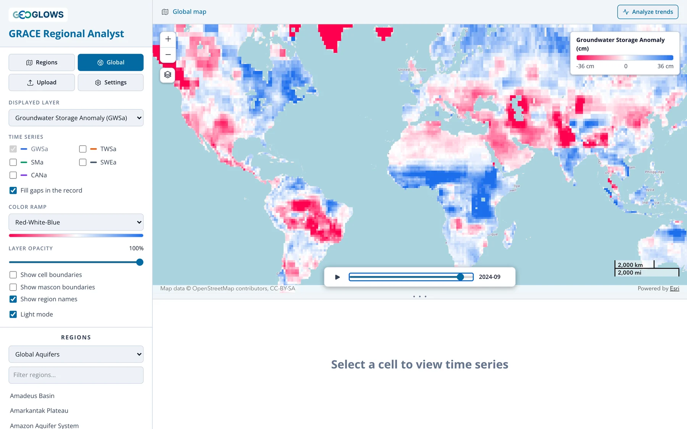
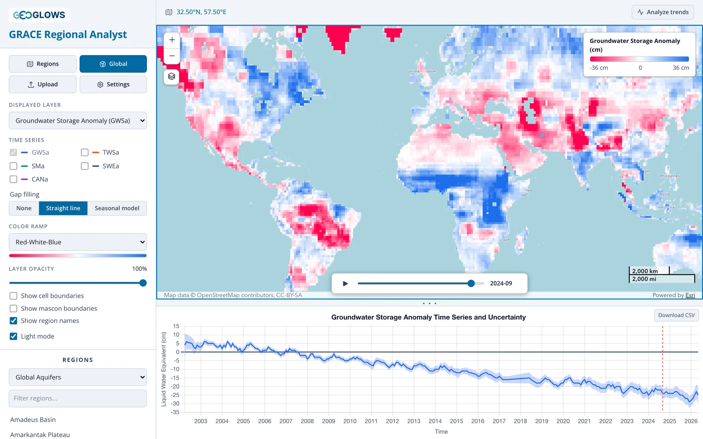
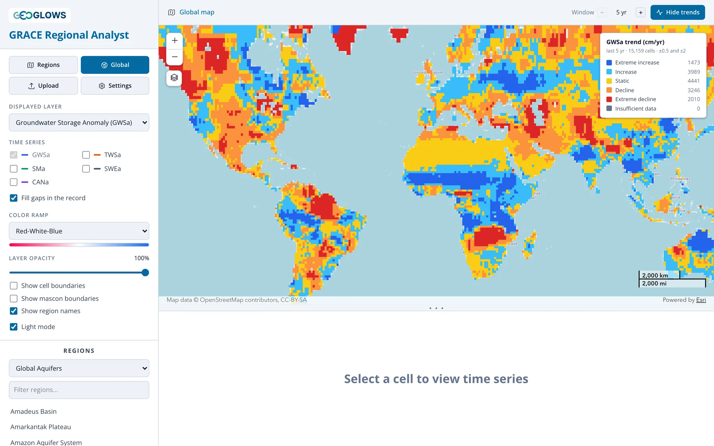

# Global View

## The global view

Click **Global** to see the displayed layer for every land cell in the world. The first time you open it, the app downloads the whole record for
that layer, which can take a little while; after that it is cached in your browser.

Press play on the time control to animate the record month by month. The global view plays faster than the regional view, about four months a
second, and loops back to the start. The animation makes the big patterns easy to spot: the steady decline across northern India, the Middle
East and the North China Plain, the rising storage across the Sahel since about 2010, and the wet and dry years that sweep across the Amazon
and southern Africa.

Change the **Displayed layer** to compare components. TWSa shows the blocky outline of the 3° mascons (see
[The GRACE Mission](../background/grace-mission.md#the-mascon-solution-used-by-the-app)); SWEa is near zero everywhere except at high latitudes
and in mountains; SMa shows the seasonal wetting and drying of soils.

## Time series for a single cell

Click any land cell to plot its time series. The breadcrumb changes to the cell's coordinates, and the chart shows the cell's values with the
±1σ uncertainty band. The CSV download for a cell is named after its coordinates.

A single cell is quick to look at, but remember that GRACE resolves about 3°, so the cell's TWSa is shared with its neighbors in the same
mascon. For a basin or aquifer, use the [regional view](regional-view.md), which averages over all the cells in the region.

## Trend map

With trends turned on, the global view colors each cell by its trend in place of the monthly anomaly, and the animation is hidden. The legend
counts the cells in each class.

See [Trend Analysis](trends.md) for how the trend is computed and how to choose the window.
