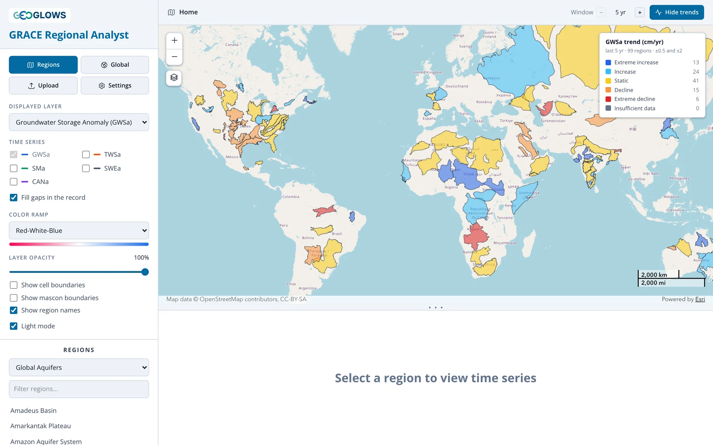
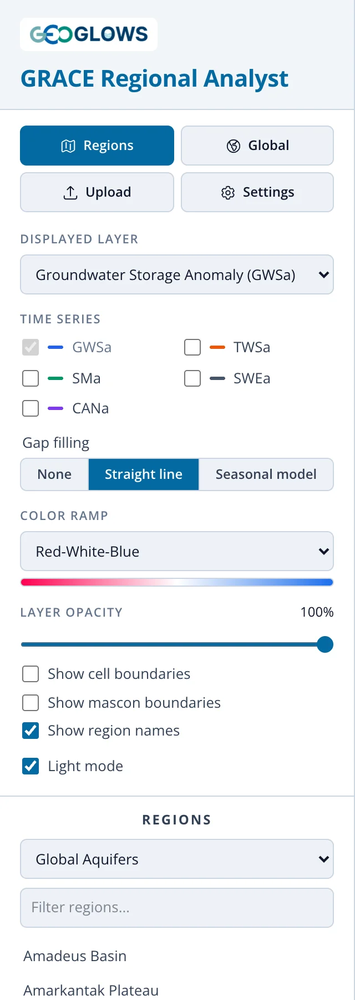
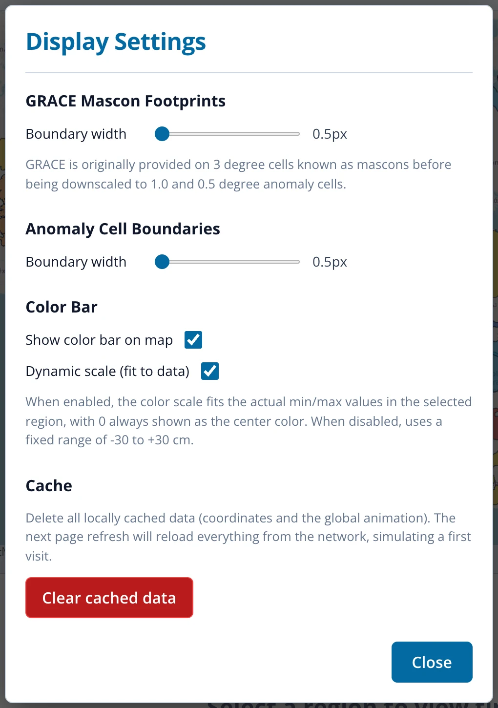

# The App Interface

## Opening the app

Open [apps.geoglows.org/grace-anomalies](https://apps.geoglows.org/grace-anomalies){:target="_blank"} in a current version of Chrome, Edge,
Firefox or Safari. Nothing needs to be installed and there is no login. The first visit downloads the data for the default layers, which can take
a few seconds on a slow connection; after that the app keeps a copy in the browser and opens quickly.

The window has three parts: the **control panel** on the left, the **map** at the top right, and the **chart panel** below the map. Drag the
three dots between the map and the chart to give either one more room; double-click them to restore the default split.

## Control panel

{ align=right width="260" }

From top to bottom:

- **Regions / Global.** Switch between the regional view, which shows region outlines and analyzes one region at a time, and the
  [global view](global-view.md), which animates the whole world. Clicking **Regions** while a region is open returns to the overview.
- **Upload.** Load your own region boundary from a GeoJSON file (see [Regional View](regional-view.md#uploading-a-region)).
- **Settings.** Display settings, described below.
- **Displayed layer.** The storage component shown on the map and plotted in the chart:
    - Groundwater Storage Anomaly (GWSa), the default
    - Total Water Storage Anomaly (TWSa)
    - Soil Moisture Anomaly (SMa)
    - Snow Water Equivalent Anomaly (SWEa)
    - Canopy Water Storage Anomaly (CANa)
- **Time series.** Check other components to add them to the chart for comparison. The displayed layer is always plotted (see
  [Regional View](regional-view.md#the-time-series-chart)).
- **Gap filling.** What the chart does at months with no GRACE data. **None** breaks the line at each gap, **Straight line** joins the
  months on either side, and **Seasonal model** fills the gaps with values estimated from the rest of the record, drawn as a dashed line with
  open markers (see [Gaps in the Record](../gap-filling/gaps.md)). The setting changes only the chart, never the downloaded CSV.
- **Color ramp.** Six palettes. Viridis, Cividis, Brown-Teal and Purple-Green are safe for readers with color vision deficiency.
- **Layer opacity.** Fade the anomaly cells to see the basemap underneath.
- **Show cell boundaries / Show mascon boundaries.** Outline the grid cells, or the 3° GRACE mascons that set the true resolution of the data.
- **Show region names.** Label region outlines once you zoom in.
- **Light mode.** Switch between the light and dark themes.
- **Regions.** Choose a region set, filter it by name, and click a name to analyze that region.

## Map

The map has zoom buttons and a basemap menu (the layers icon below the zoom buttons) offering OpenStreetMap, topographic, imagery, streets,
light gray, dark gray and terrain basemaps. A scale bar sits in the lower right. The color bar in the upper right gives the scale for the
anomaly cells, always centered on zero; the trend legend appears above it while trends are shown.

The **time control** at the bottom of the map steps through the months:

{ width="410" }

Press play to animate, or drag the slider. The slider only stops on months that have GRACE data. The current month is also marked on the chart
with a red dashed line.

## Header bar

{ width="800" }

The breadcrumb on the left shows where you are: **Home** (the overview), a region name, **Global map**, or the coordinates of a selected cell.
Click **Home** to return to the overview. On the right, **Analyze trends / Hide trends** turns trend classification on and off, and the
**Window** stepper sets the period the trend is computed over. See [Trend Analysis](trends.md).

## Settings

{ width="510" }

- **GRACE mascon footprints** and **anomaly cell boundaries:** line widths for the two outline layers.
- **Show color bar on map:** hide or show the color bar.
- **Dynamic scale (fit to data):** with this on, the color scale stretches to fit the data you're looking at, so small anomalies remain visible.
  In a region it fits the largest absolute value in the region's cells over the whole record; in the global view it fits the 95th percentile of
  absolute values, so a few extreme cells don't wash out the rest of the map. Turn it off to use a fixed scale of −30 to +30 cm, which is
  better when comparing screenshots of different regions.
- **Clear cached data:** delete the copy of the data the app keeps in your browser. The next visit downloads everything again. Use this if the
  app behaves oddly after a data update.

Settings last until you close the page. The light or dark theme and the size of the chart panel are remembered between visits.
