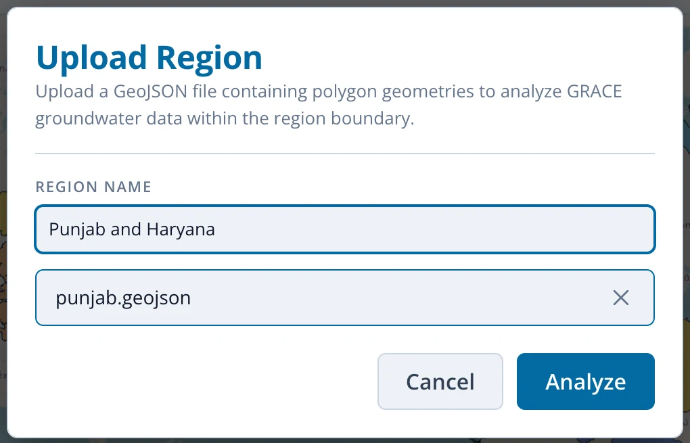
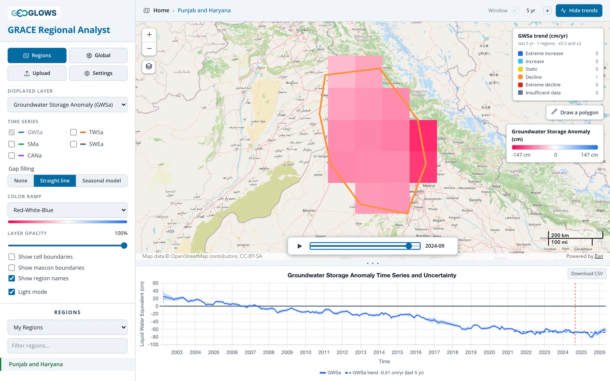
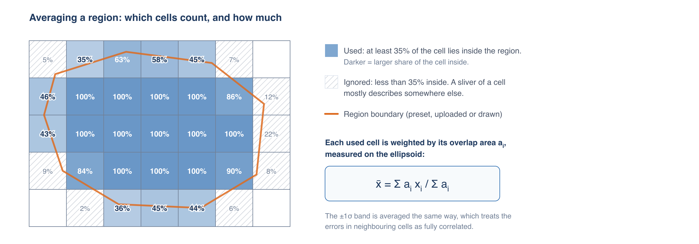
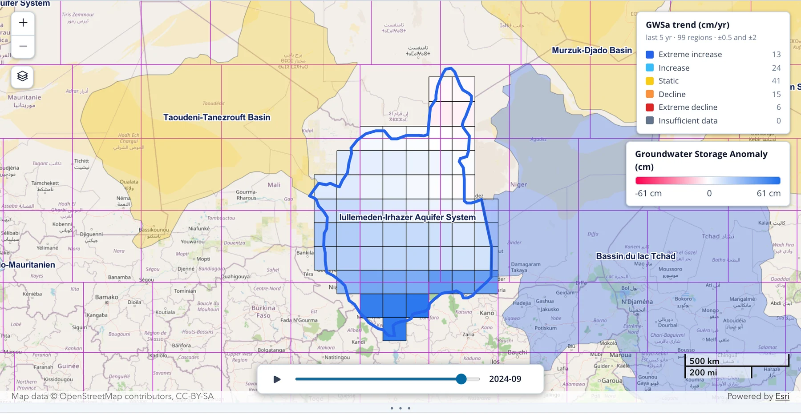

# Vue Régionale

## La page d’accueil { #the-landing-page }

L’application s’ouvre sur la vue régionale, qui affiche les contours de toutes les régions du jeu de régions actif. Le jeu par défaut est Global
Aquifers. Chaque contour est coloré selon la tendance du stockage des eaux souterraines sur les cinq dernières années, et la légende en haut à
droite compte les régions de chaque classe de tendance (voir [Analyse des Tendances](trends.md)). Cliquez sur **Hide trends** pour afficher
de simples contours.

À partir de là, vous pouvez :

- déplacer la carte et zoomer ; les noms des régions apparaissent une fois le zoom suffisant (désactivez-les avec **Show region names**)
- passer à un autre jeu de régions, ou filtrer la liste des noms, dans la section **Regions** du panneau de contrôle
- modifier la couche affichée (**Displayed layer**) ou la fenêtre de tendance (**Window**) pour reclasser toutes les régions d’un coup, par
  exemple pour voir quels aquifères ont perdu du stockage total en eau au cours des 20 dernières années
- ouvrir une région pour l’analyser, comme décrit ci-dessous

Sur cette page, le fil d’Ariane de l’en-tête indique **Home**. Après avoir ouvert une région, cliquez sur **Home** ou sur le bouton **Regions**
pour revenir.

## Choisir une région { #choosing-a-region }

Il existe trois façons d’ouvrir une région pour l’analyser :

1. Cliquer sur son contour sur la carte, ou sur son nom dans la liste du panneau de contrôle.
2. Importer une limite depuis un fichier GeoJSON.
3. Dessiner un polygone sur la carte.

### Jeux de régions prédéfinis { #preset-region-sets }

Choisissez un jeu dans la liste déroulante sous **Regions**. Saisissez du texte dans **Filter regions…** pour restreindre la liste.

| Jeu de régions | Régions | Source |
|---|---|---|
| Global Aquifers | 99 | Compilé par l’équipe GEOGLOWS à partir de plusieurs sources, complété par les jeux WHYMAP et IGRAC ci-dessous |
| Large Aquifer Systems (WHYMAP) | 37 | Large Aquifer Systems of the World, WHYMAP (BGR/UNESCO) |
| Transboundary Aquifers (IGRAC) | 155 | Transboundary Aquifers of the World 2025, UNESCO-IHP / IGRAC (CC BY-SA 3.0 IGO) |
| Principal Aquifers, USA (USGS) | 31 | Principal Aquifers of the United States, U.S. Geological Survey |
| Major River Basins (GRDC) | 456 | Major River Basins of the World, Global Runoff Data Centre (usage non commercial uniquement) |
| My Regions | les vôtres | Les régions que vous avez importées |

L’attribution du jeu actif est indiquée sous la liste. Citez-la si vous publiez des résultats fondés sur ce jeu.

### Importer une région { #uploading-a-region }

Cliquez sur **Upload**, choisissez ou faites glisser un fichier GeoJSON (`.geojson` ou `.json`, jusqu’à 50 MB), donnez un nom à la région et
cliquez sur **Analyze**.

{ width="510" }

Le fichier doit contenir des entités Polygon ou MultiPolygon en longitude et latitude WGS 84, conformément à la norme GeoJSON. S’il contient
plusieurs entités, elles sont fusionnées en une seule région. Les trous des polygones sont ignorés.

!!! tip "Convertir un shapefile"
    L’application ne lit que le GeoJSON. Pour convertir un shapefile, ouvrez-le dans QGIS, faites un clic droit sur la couche, choisissez
    **Export → Save Features As…**, puis réglez le format sur GeoJSON et le SCR sur EPSG:4326. [mapshaper.org](https://mapshaper.org){:target="_blank"}
    fait la même chose dans un navigateur : importez ensemble les fichiers `.shp`, `.dbf` et `.prj`, puis exportez en GeoJSON. Simplifier au
    préalable une limite très détaillée réduit la taille du fichier sans changer le résultat, puisque les mailles de la grille font 1° de côté.

Les régions importées sont enregistrées dans **My Regions**, où vous pouvez les rouvrir ou les supprimer avec le × à côté du nom. Elles sont
stockées uniquement dans votre navigateur : elles ne sont partagées avec personne et n’apparaîtront ni sur un autre ordinateur ni dans un autre
navigateur.

### Dessiner une région { #drawing-a-region }

Sélectionnez **My Regions** dans la liste déroulante des jeux de régions, puis cliquez sur **Draw a polygon** sur la carte. Cliquez pour placer
chaque sommet et double-cliquez pour terminer. L’application analyse le polygone immédiatement. Les polygones dessinés ne sont pas enregistrés ;
importez un fichier si vous souhaitez conserver une région.

## Lire les résultats { #reading-the-results }

Lorsque vous ouvrez une région, la carte zoome sur celle-ci et affiche les mailles d’anomalie de la couche affichée à l’intérieur de sa limite,
et le graphique présente la série temporelle moyenne de la région (voir [Le graphique des séries temporelles](#the-time-series-chart)).

### Mailles prises en compte dans la moyenne { #which-cells-are-averaged }

La moyenne régionale utilise toutes les mailles de la grille dont au moins 35 % de la surface se trouve dans la région, et pondère chacune par la
surface de recouvrement. Les mailles situées en majeure partie hors de la région sont exclues ; les mailles en bordure comptent au prorata de leur
part située à l’intérieur.

La TWSa est moyennée sur sa grille de 0.5° et les autres couches sur leur grille de 1°, chacune avec ses propres poids de recouvrement. Une région
plus petite qu’environ 35 % d’une maille peut n’avoir aucune maille éligible ; utilisez alors une région plus grande ou cliquez sur la maille dans
la [vue globale](global-view.md).

### Afficher la grille { #showing-the-grid }

Activez **Show cell boundaries** et **Show mascon boundaries** pour voir comment la région se situe par rapport à la grille et à la résolution
réelle de GRACE :

Ici, la région couvre des parties de plusieurs mascons (en violet) ; sa moyenne s’appuie donc sur plusieurs valeurs GRACE indépendantes. Une
région située à l’intérieur d’un seul mascon est sujette à la [fuite du signal](../background/resolution-and-leakage.md) décrite dans la partie
Contexte.

## Le graphique des séries temporelles { #the-time-series-chart }

Le graphique sous la carte trace la moyenne de la région pour chaque mois en cm d’équivalent en eau liquide, avec le zéro (la moyenne 2004–2009)
représenté par une ligne continue. Faites glisser le séparateur entre la carte et le graphique pour agrandir le graphique.

Survolez le graphique pour lire les valeurs d’un mois. La ligne rouge en tirets repère le mois affiché sur la carte et se déplace lorsque vous
avancez ou lancez la lecture avec le contrôle temporel.

### Incertitude { #uncertainty }

Lorsqu’une seule composante est tracée, une bande ombrée indique ±1σ. La bande est moyennée sur les mailles de la même façon que les valeurs, ce
qui revient à considérer les erreurs des mailles voisines comme entièrement corrélées. C’est le choix prudent : des erreurs qui se compensent en
partie d’une maille à l’autre donneraient une bande plus étroite. La bande est masquée lorsque plusieurs composantes sont tracées, pour que le
graphique reste lisible.

### Comparer les composantes { #comparing-components }

Le graphique trace toujours la couche affichée (**Displayed layer**). Cochez d’autres composantes sous **Time series** dans le panneau de contrôle
pour les ajouter sur les mêmes axes :

| Composante | Source | Ce qu’elle représente |
|---|---|---|
| TWSa | GRACE | toute l’eau de la colonne : eaux souterraines, humidité du sol, neige, canopée et eaux de surface |
| GWSa | TWSa moins les trois couches GLDAS | eaux souterraines, eaux de surface incluses |
| SMa | GLDAS | humidité du sol |
| SWEa | GLDAS | équivalent en eau de la neige |
| CANa | GLDAS | eau retenue par la canopée végétale |

[Calcul du Stockage des Eaux Souterraines](../background/deriving-groundwater.md) explique comment les couches s’articulent.

La comparaison des composantes montre ce qui détermine le signal des eaux souterraines. Dans l’exemple ci-dessus, l’humidité du sol (en vert)
présente un fort cycle saisonnier mais aucune tendance de long terme, tandis que le stockage total en eau (en orange) et les eaux souterraines
(en bleu) augmentent ensemble à partir de 2010 environ : la hausse du stockage total correspond donc aux eaux souterraines.

### Comblement des lacunes { #gap-filling }

GRACE ne fournit aucune donnée pour 35 mois de la série ; la TWSa et la GWSa présentent donc des lacunes, alors que les couches GLDAS ont une
valeur chaque mois. Le contrôle **Gap filling** détermine comment le graphique trace les lacunes :

- **None** interrompt la courbe à chaque lacune.
- **Straight line** relie les mois situés de part et d’autre de chaque lacune.
- **Seasonal model** estime les mois manquants à partir d’une tendance et d’un cycle saisonnier ajustés sur la série propre à la région, et les
  trace en tirets avec des marqueurs creux, comme dans le graphique ci-dessus.

Ce réglage ne modifie que le graphique. La Partie 3 compare les trois options dans [Lacunes dans les Données](../gap-filling/gaps.md), puis
présente la méthode complète.

### Droites de tendance { #trend-lines }

Lorsque les tendances sont activées (**Analyze trends** dans l’en-tête), chaque composante tracée reçoit sa droite de tendance ajustée, en tirets,
sur la fenêtre de tendance, et la légende indique sa pente, par exemple « GWSa trend −0.29 cm/yr (last 5 yr) ». Voir
[Analyse des Tendances](trends.md).

### Analyse de la recharge { #recharge-analysis }

Lorsque **Seasonal model** est sélectionné, un bouton **Recharge Analysis** apparaît au-dessus du graphique. Il ouvre une page qui estime la
recharge annuelle des eaux souterraines à partir de la série GWSa comblée, par la méthode de fluctuation de la nappe. L’analyse utilise toujours
la GWSa, quelle que soit la couche affichée. La Partie 4 la décrit, en commençant par [La Méthode WTF](../recharge/wtf-method.md).

### Télécharger les données { #downloading-the-data }

**Download CSV** enregistre les valeurs mensuelles des cinq composantes pour la région, avec leurs bornes ±1σ et les séries TWSa et GWSa
comblées, quelles que soient les composantes tracées et l’option de comblement sélectionnée. [Téléchargement des Données](downloading-data.md)
décrit les colonnes et montre comment convertir les valeurs en volumes.
