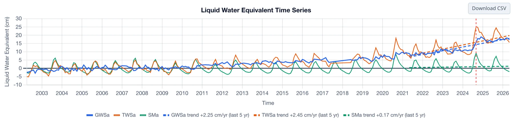

# Case Studies

The three studies below used the same GRACE-derived groundwater storage as the app, together with other data, to answer practical
questions about real aquifers. Each shows a different side of working with GRACE: estimating recharge where wells are scarce, accounting for a
large surface reservoir, and correcting for leakage in a narrow, heavily pumped valley.

## Niger: storage change and recharge in the Iullemeden and Chad Basins

Barbosa, S. A., Pulla, S. T., Williams, G. P., Jones, N. L., Mamane, B., and Sanchez, J. L. (2022). Evaluating groundwater storage change and
recharge using GRACE data: A case study of aquifers in Niger, West Africa. *Remote Sensing*, 14(7), 1532.
[doi:10.3390/rs14071532](https://doi.org/10.3390/rs14071532){:target="_blank"}

This study was carried out under the NASA SERVIR West Africa project with AGRHYMET, using GGST, the predecessor of the GRACE Regional Analyst.
It follows the same workflow as Part 3 of this training: derive GWSa for each aquifer, fill the gaps in the record, and estimate annual recharge
with the water table fluctuation method.

### Setting

Southern Niger overlies two large sedimentary basins: the Iullemeden Basin in the west, with the Continental Terminal, Continental Intercalaire
and Quaternary aquifers, and the Lake Chad Basin in the east, with the Manga, Quaternary and Korama aquifers. Both are in the Sahel, where nearly
all rain falls between June and September and monitoring wells are few.

### Storage change

GWSa rose in both basins over 2002–2021. The rise was larger in the Iullemeden Basin, from about −2 cm early in the record to about +12 cm by
2021, and smaller in the Chad Basin. In both basins the rise tracked increasing annual rainfall after the drought decades of the 1970s and 1980s,
and soil moisture, which has a strong seasonal cycle, showed no comparable trend. The same pattern is visible in the app today:

### Recharge

After filling the gaps with a trend-plus-seasonal model, the authors applied the water table fluctuation method to each year of the GWSa record.
Method 1 counts only the visible seasonal rise (a lower estimate); Method 2 adds the drainage that the rise offset (an upper estimate).

| Basin | Period | Recharge, Method 1 – Method 2 (cm/yr) |
|---|---|---|
| Iullemeden | 2002–2011 | 4.0 – 7.3 |
| Iullemeden | 2012–2021 | 4.5 – 9.2 |
| Chad | 2002–2011 | 2.9 – 5.4 |
| Chad | 2012–2021 | 4.1 – 7.6 |

Recharge was higher in the second decade in both basins, consistent with the rising storage. The GRACE estimates fall within or slightly above
the range of earlier local studies in southwestern Niger, which used chloride mass balance, well hydrographs and isotope dating and found from
under 1 cm/yr (long-term, from isotopes) to 2–6 cm/yr (from water table fluctuations in wells).

### What the study shows

- GRACE can give a basin-wide record of storage change and recharge where wells are too sparse to do so.
- Filling the gaps matters for annual recharge: a missing month near a seasonal peak or trough changes that year's estimate.
- Method 1 and Method 2 bracket the likely recharge. Reporting both is more honest than choosing one.
- The results are averages over areas of hundreds of thousands of square kilometers. They describe the basin, not any particular well field.

## Volta Basin: separating a large reservoir from groundwater

Barbosa, S. A., Jones, N. L., Williams, G. P., Teklu, H., Yidana, S. M., Pulla, S. T., Sanchez, J. L., Nelson, E. J., Ames, D. P., and
Miller, A. W. (2025). A multi-source approach to groundwater storage and recharge assessment in the Volta Basin. *Science of The Total
Environment*, 1001, 180421. [doi:10.1016/j.scitotenv.2025.180421](https://doi.org/10.1016/j.scitotenv.2025.180421){:target="_blank"}

The Volta Basin covers parts of Ghana, Burkina Faso, Togo, Mali, Côte d'Ivoire and Benin. Lake Volta, behind the Akosombo Dam, is one of the
largest reservoirs in the world by surface area, and the study found that its fluctuations account for about half of the basin's total water
storage anomaly. The water balance used in the app leaves surface water out (see
[Deriving Groundwater Storage](../background/deriving-groundwater.md#the-water-balance)), so in the Volta Basin the app's GWSa includes the
lake. The study removed it using Copernicus satellite data on surface water before attributing the remainder to groundwater.

The study combined that GRACE-derived groundwater storage with CHIRPS precipitation and compared it with the GLDAS v2.2 Catchment model's own
groundwater storage estimate. Its findings:

- Groundwater storage changed little from 2002 to 2012, then rose substantially from 2012 to 2022, for a total gain of about 30 km³, or about
  10 cm of liquid water equivalent over the basin.
- GLDAS v2.2 showed the same seasonal timing as GRACE but larger anomalies.
- Recharge estimated with the water table fluctuation method on the GRACE- and GLDAS-derived series agreed with values from monitoring wells in
  the basin and with previous studies.
- Recharge was only weakly related to extreme rainfall events. Land use change and agricultural practices may also affect storage and recharge.

**Lesson for app users:** before reading GWSa as groundwater in a basin with a large lake, reservoir or wetland, check how much of the total
storage signal the surface water accounts for, and remove it if it is large.

## California's Central Valley: correcting GRACE with well data

Stevens, M. D., Ramirez, S. G., Martin, E.-M. H., Jones, N. L., Williams, G. P., Adams, K. H., Ames, D. P., and Pulla, S. T. (2025).
Groundwater storage loss in the Central Valley analysis using a novel method based on in situ data compared to GRACE-derived data.
*Environmental Modelling & Software*, 186, 106368.
[doi:10.1016/j.envsoft.2025.106368](https://doi.org/10.1016/j.envsoft.2025.106368){:target="_blank"}

California's Central Valley is one of the most heavily pumped aquifer systems in the world, and a textbook case of
[leakage](../background/resolution-and-leakage.md#leakage): the valley is narrower than a GRACE mascon, and the pumping decline is concentrated
in it, surrounded by mountains where storage behaves differently. Averaged over the valley, GRACE underestimates the storage loss.

The study built an independent estimate of storage change from wells. Well records in the valley are irregular, with long gaps and many short
records, so the authors filled each well's record with a machine learning model (an extreme learning machine) driven by Earth observation
data, including the Palmer Drought Severity Index and GLDAS soil moisture. They then interpolated the filled records into monthly water level
surfaces by kriging, and converted changes in water level to changes in storage with a map of specific yield. The well-based storage change
and the GRACE-derived storage change were significantly correlated, and the ratio between them gave a scale factor that corrects the GRACE values
for leakage in the valley.

**Lesson for app users:** for a small or narrow aquifer, the GRACE average from the app captures the timing and direction of storage change
but can understate its size. Where well data exist for part of the record, calibrating a scale factor against them corrects for that, for that
aquifer.

To reproduce the Niger and Volta analyses for any region, follow [Filling Gaps](gap-filling.md) and [Estimating Recharge](recharge-wtf.md)
with a CSV downloaded from the app.
