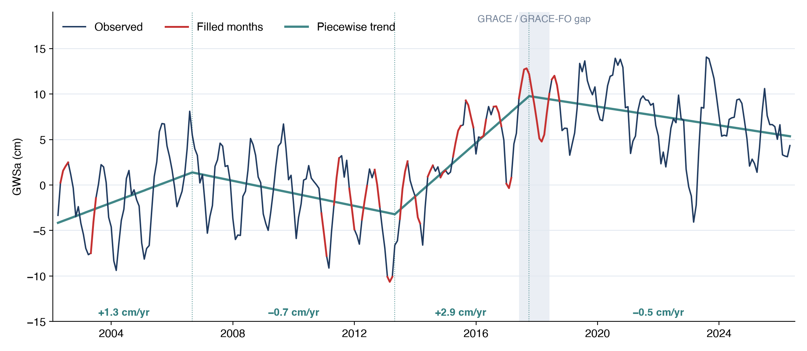

# Filling Gaps

## Why fill the gaps

The GRACE record is missing 35 of its months: scattered single months, mostly between 2011 and 2017, and the 11 months between the end of
GRACE and the start of GRACE-FO (see [The GRACE Mission](../background/grace-mission.md#the-record-and-its-gaps)). Trend analysis in the app
handles gaps by skipping them. Analyses that work year by year, such as estimating recharge with the
[water table fluctuation method](recharge-wtf.md), need a value for every month: a missing month at a seasonal peak or trough changes that
year's result.

The **Fill gaps in the record** checkbox in the app only draws a straight line across a gap on the chart. It doesn't estimate the missing values,
and the CSV still has blanks in those months.

## Method

The notebook for this page fills gaps with a statistical model of the series, following the approach of Barbosa et al. (2022):

```text
GWSa(t) = trend(t) + seasonal(month of t) + residual(t)
```

1. **Trend.** A piecewise straight line, allowed to bend at up to three breakpoints, captures the long-term rise or decline. The notebook
   chooses the number and position of the breakpoints automatically, adding a breakpoint only when it improves the fit substantially (by the
   Bayesian information criterion), and keeps every segment at least three years long.
2. **Seasonal cycle.** One value for each calendar month, the average departure from the trend in that month. Together with the trend this gives
   the model value for any month.
3. **Residual.** The difference between the observed value and the model in the months on either side of a gap. The notebook interpolates the
   residual linearly across the gap and adds it to the model value, so the filled months join the observed record smoothly at both ends.

Observed months are never changed.



For a single missing month, the filled value is close to a straight line between its neighbors. For the 11-month gap between missions, it
follows the seasonal cycle and the trend, which a straight line can't.

## How good is the fill?

The notebook checks the fill by hiding months that do have data, filling them, and comparing the result with the real values. It runs two
tests: hiding 10% of the months one at a time, and hiding 11-month blocks at several places in the record to mimic the gap between missions. For
the Iullemeden-Irhazer Aquifer System, the filled values are typically within about 1 to 1.5 cm of the truth in both tests, smaller than the
GRACE uncertainty of about 2 cm. Regions with large year-to-year swings, such as California's Central Valley, fill less well, because no model
can predict an unusually wet or dry year inside a long gap.

The test results are printed in the notebook for your region. If the error is close to or larger than the ±1σ uncertainty, treat analyses that
depend on the filled months with extra caution.

## Running the notebook

[Open in Google Colab](https://colab.research.google.com/github/Aquaveo/training.geoglows.org/blob/main/docs/static/files/grace/grace_gap_fill_and_recharge.ipynb){:target="_blank"}
or [download the notebook](../../static/files/grace/grace_gap_fill_and_recharge.ipynb) to run it in Jupyter on your own computer. It needs only
pandas, NumPy and Matplotlib, which Colab already has.

1. [Download a CSV](../app/downloading-data.md) for your region from the app. Without a file of your own, the notebook uses a
   [sample export](../../static/files/grace/sample_iullemeden.csv) for the Iullemeden-Irhazer Aquifer System.
2. In the settings cell, set `CSV_FILE` to your file name and `VARIABLE` to the column to fill (`GWSa` by default). In Colab, run the cell and
   upload the file when prompted.
3. Run the cells in order (**Runtime → Run all** in Colab). The notebook plots the raw series and lists the missing months, fits the model,
   plots the filled series, and runs the fill-quality tests.
4. The notebook writes `<name>_filled.csv`, with the observed value, the filled value and a flag for each filled month, along with the trend and
   seasonal components. In Colab it downloads automatically.

The automatic breakpoint choice works well for most regions. To force a simpler trend, set `N_BREAKPOINTS` to 0 (a single straight line), 1, 2
or 3.

## Reference

Barbosa, S. A., Pulla, S. T., Williams, G. P., Jones, N. L., Mamane, B., and Sanchez, J. L. (2022). Evaluating groundwater storage change and
recharge using GRACE data: A case study of aquifers in Niger, West Africa. *Remote Sensing*, 14(7), 1532.
[doi:10.3390/rs14071532](https://doi.org/10.3390/rs14071532){:target="_blank"}
