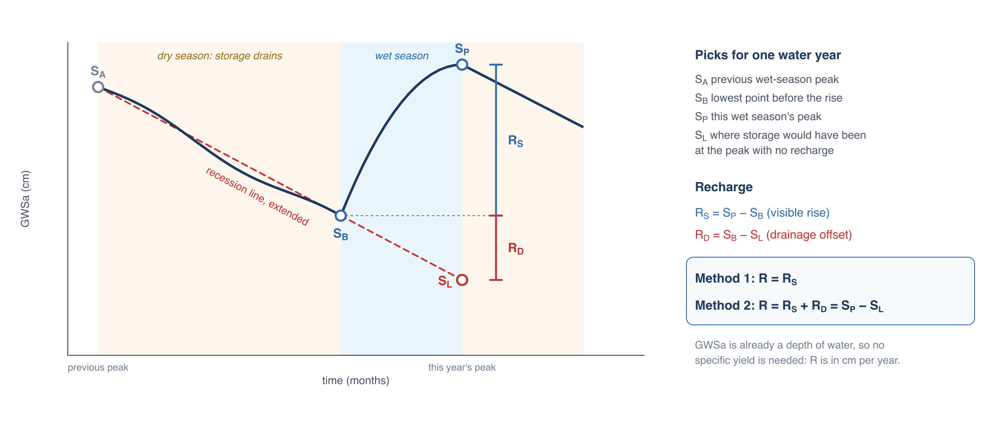
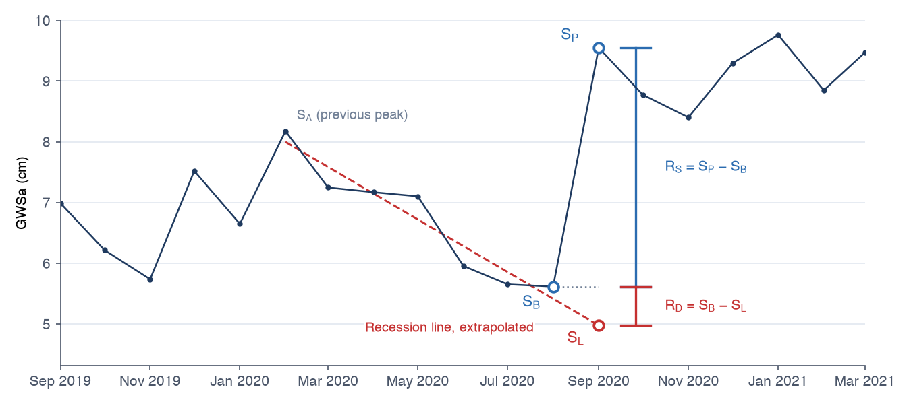

## The water table fluctuation method

The water table fluctuation (WTF) method estimates groundwater recharge from the seasonal rise in groundwater levels. In a climate with a dry
and a wet season, storage drains through the dry season, then rises when rain and snowmelt reach the water table. The size of the rise reflects
how much water entered the aquifer. The method is usually applied to well hydrographs, where the rise in head is multiplied by the aquifer's
specific yield to give a depth of water (Healy and Cook, 2002). GWSa is already a depth of water, so applied to GRACE the method needs no
specific yield and gives recharge directly in cm per year, averaged over the region.



For each water year (one dry season followed by one wet season) the method uses four values:

- **S<sub>A</sub>**, the previous wet-season peak, where the recession begins
- **S<sub>B</sub>**, the lowest point before this year's rise
- **S<sub>P</sub>**, this year's wet-season peak
- **S<sub>L</sub>**, where storage would have been at the time of the peak if it had kept draining at the dry-season rate, found by extending
  the recession line fitted from S<sub>A</sub> to S<sub>B</sub>

Two estimates follow:

| | Recharge | What it counts |
|---|---|---|
| Method 1 | R = R<sub>S</sub> = S<sub>P</sub> − S<sub>B</sub> | the visible rise only |
| Method 2 | R = R<sub>S</sub> + R<sub>D</sub> = S<sub>P</sub> − S<sub>L</sub> | the rise plus the drainage it offset |

During the wet season the aquifer keeps draining while it is being recharged, so the visible rise understates recharge: Method 1 is a lower
estimate. Method 2 adds back the drainage that would have occurred, R<sub>D</sub> = S<sub>B</sub> − S<sub>L</sub>, but depends on extending the
recession line well past the months it was fitted to, so it is an upper estimate. Report both.

## Applying it to GRACE data

Before applying the method, [fill the gaps](gap-filling.md): a missing month at a peak or trough changes that year's picks. The notebook below
does both steps in one run.



The notebook picks S<sub>B</sub> and S<sub>P</sub> on the series with the long-term trend removed, so a steady decline or rise doesn't push the
picks to the edges of the water year, then reads the values from the filled series. The water year starts in the calendar month when storage is
usually lowest, found from the seasonal cycle; set `WATER_YEAR_START_MONTH` to override it. The notebook reports for each year:

- S<sub>P</sub>, S<sub>B</sub>, S<sub>L</sub>, R<sub>S</sub>, R<sub>D</sub>, Method 1 and Method 2, in cm
- whether the peak, trough or recession used filled months
- whether the recession line was extended much further than the period it was fitted over

and plots every year with its picks so you can check them. If a pick is wrong, for example a small spike taken as the peak, correct it in the
`OVERRIDES` setting and rerun:

```python
OVERRIDES = {2020: {"peak": "2020-09"}}
```

That is the override used for the example figure above. Without it, the notebook takes a slightly higher month in January 2021 as the
2020 peak. The September 2020 peak at the end of the wet season is the better choice. Water years are named by the calendar year they start
in, and each entry can set `"peak"`, `"trough"` or both.

To convert recharge to a volume, set `AREA_KM2` to the area of your region. The notebook then reports km³/yr and million m³/yr as well.

[Open in Google Colab](https://colab.research.google.com/github/Aquaveo/training.geoglows.org/blob/main/docs/static/files/grace/grace_gap_fill_and_recharge.ipynb){:target="_blank"}
or [download the notebook](../../static/files/grace/grace_gap_fill_and_recharge.ipynb). See [Filling Gaps](gap-filling.md#running-the-notebook)
for how to load your CSV.

## Interpreting the results

- **Use multi-year means.** The ±1σ uncertainty of a monthly GWSa value, about 2 cm in the Iullemeden example, is the same size as a typical
  annual rise. A single year's estimate is uncertain; a mean over ten years is much more robust.
- **Check years that use filled months.** Results for years whose peak or trough falls in a filled month, especially around the 2017–2018 gap
  between missions, depend on the gap-filling model.
- **Treat Method 2 as an upper bound.** Where the recession line is fitted over a few months and extended much further, R<sub>D</sub> can
  exceed R<sub>S</sub> and Method 2 can be inflated. The notebook flags these years.
- **Pumping is not recharge.** In basins with heavy groundwater pumping, the recession includes the pumping decline as well as natural
  drainage, so R<sub>D</sub>, and with it Method 2, includes the pumping. Method 1 is the safer estimate there.
- **The method needs a seasonal cycle.** In humid regions with recharge all year, or arid regions with little seasonal rise, the WTF method
  doesn't apply.
- **Compare with independent estimates.** Chloride mass balance, well hydrographs or published studies for the same aquifer give a check on the
  GRACE numbers. The [Niger case study](case-studies.md) is an example.

## References

- Healy, R. W., and Cook, P. G. (2002). Using groundwater levels to estimate recharge. *Hydrogeology Journal*, 10, 91–109.
  [doi:10.1007/s10040-001-0178-0](https://doi.org/10.1007/s10040-001-0178-0){:target="_blank"}
- Barbosa, S. A., Pulla, S. T., Williams, G. P., Jones, N. L., Mamane, B., and Sanchez, J. L. (2022). Evaluating groundwater storage change and
  recharge using GRACE data: A case study of aquifers in Niger, West Africa. *Remote Sensing*, 14(7), 1532.
  [doi:10.3390/rs14071532](https://doi.org/10.3390/rs14071532){:target="_blank"}
