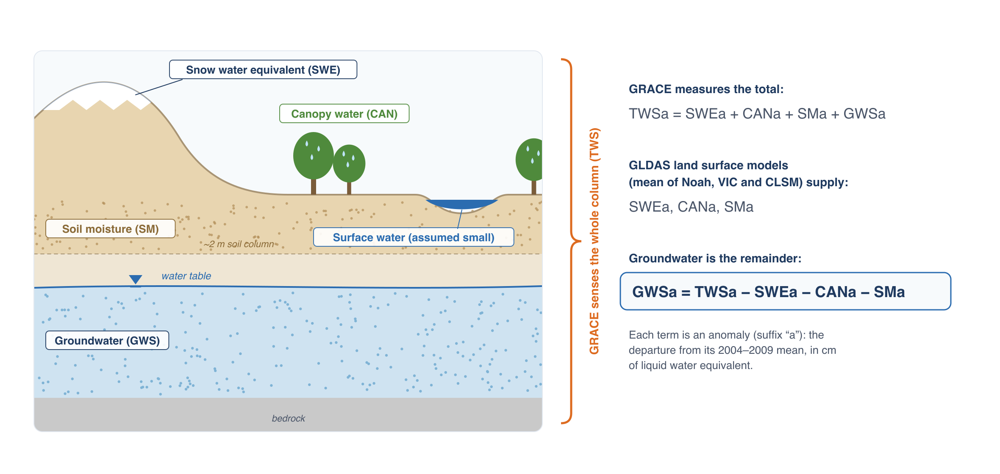
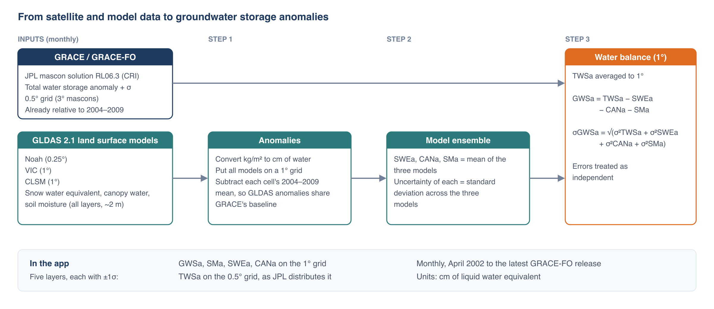

## The water balance

GRACE measures the total change in water stored in a column of the Earth. To isolate groundwater, the app subtracts the parts of that total that
can be estimated by other means:



TWSa is the sum of the anomalies of every store in the column: snow water equivalent (SWEa), water held on vegetation canopies (CANa), soil
moisture (SMa), groundwater (GWSa) and surface water in rivers, lakes and reservoirs. Land surface models estimate the first three well. Removing
them leaves groundwater:

```text
GWSa = TWSa − SWEa − CANa − SMa
```

The app leaves surface water out of the balance, so any change in surface water storage ends up in GWSa. Over most of the world surface water
changes are small next to the other terms. In regions with large reservoirs, wetlands, or rivers with big floods (the Amazon, the Ganges and
Brahmaputra, the Caspian Sea, Lake Victoria), GWSa includes those changes and overstates the seasonal swing in groundwater.

## GLDAS land surface models

NASA's Global Land Data Assimilation System (GLDAS) runs land surface models forced with observed precipitation, radiation and meteorology to
estimate how much water the land surface stores each month. The app uses three GLDAS version 2.1 models, which differ in how they represent soil
layers and runoff:

| Model | Grid | Soil moisture used |
|---|---|---|
| Noah | 0.25° | four layers, 0–200 cm |
| VIC (Variable Infiltration Capacity) | 1° | three layers, depths vary by location |
| CLSM (Catchment Land Surface Model) | 1° | total soil profile |

From each model the app takes snow water equivalent, canopy interception storage and soil moisture, converts them from kg/m² to cm of water, and
puts all three models on the same 1° grid (Noah is averaged from 0.25° up to 1°). Each model's anomaly is its value minus that cell's mean for
2004–2009, the same baseline as GRACE.

The three models often disagree, particularly about deep soil moisture. Rather than choose one, the app averages them: SWEa, CANa and SMa are each
the mean of the three models, and the spread between the models (their standard deviation) is used as the uncertainty of each term.

## Processing chain



GRACE TWSa is averaged from 0.5° to 1° and combined with the model ensemble to give GWSa on a 1° grid. The app serves five layers: GWSa, SMa, SWEa
and CANa at 1°, and TWSa at 0.5° as JPL distributes it. Using 1° for the derived layers follows the usual practice of combining GRACE with model data at
the coarser of the two grids; reporting GWSa at 0.5° would give an impression of detail that neither dataset has.

No gain or scale factors are applied to the GRACE data, and no gaps are filled. Each monthly value in the app is the published JPL value combined
with the GLDAS ensemble for that month.

## Uncertainty

Each layer in the app comes with a one-standard-deviation (1σ) uncertainty, which the time series chart draws as a band around the line:

- **TWSa:** JPL's published uncertainty for each mascon and month.
- **SWEa, CANa, SMa:** the standard deviation across the three GLDAS models.
- **GWSa:** the four combined, treating them as independent:

```text
σGWSa = √( σTWSa² + σSWEa² + σCANa² + σSMa² )
```

The uncertainty band captures the measurement error in GRACE and the disagreement between models. It doesn't capture errors the three models
share, the effect of leaving out surface water, or leakage from outside a region (see
[Resolution, Leakage and Small Regions](resolution-and-leakage.md)), so the true uncertainty is larger than the band shows.

## What GWSa is good for

GWSa is best used to answer regional questions about direction and rate: is storage in this aquifer declining, how fast, and did the decline
slow after a policy change or a run of wet years? It is not suited to decisions at the scale of a well field or a single irrigation district,
and it says nothing about water levels or water quality. Where monitoring wells exist, compare the GRACE trend with storage change estimated from
the wells; agreement between the two strengthens both.

## References

- Rodell, M., et al. (2004). The Global Land Data Assimilation System. *Bulletin of the American Meteorological Society*, 85, 381–394.
  [doi:10.1175/BAMS-85-3-381](https://doi.org/10.1175/BAMS-85-3-381){:target="_blank"}
- GLDAS data at the NASA GES DISC: [Noah](https://disc.gsfc.nasa.gov/datasets/GLDAS_NOAH025_M_2.1/summary){:target="_blank"},
  [VIC](https://disc.gsfc.nasa.gov/datasets/GLDAS_VIC10_M_2.1/summary){:target="_blank"},
  [CLSM](https://disc.gsfc.nasa.gov/datasets/GLDAS_CLSM10_M_2.1/summary){:target="_blank"}
