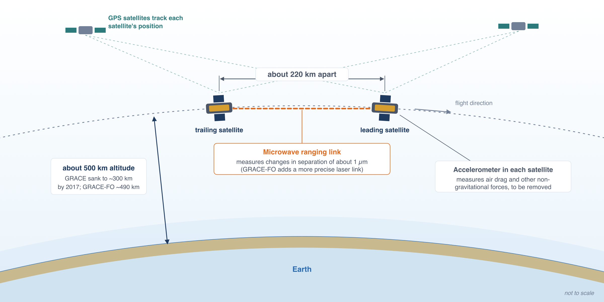
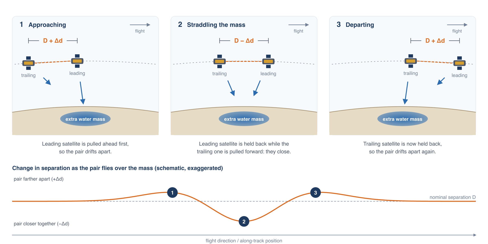
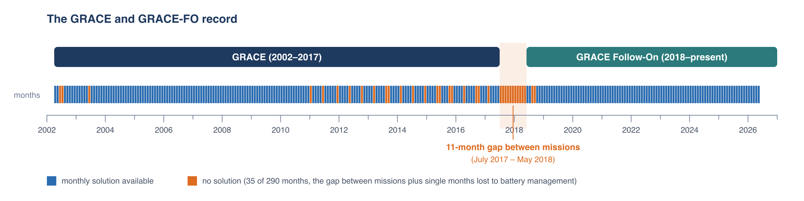

# The GRACE Mission

## Two satellites that weigh water

GRACE (Gravity Recovery and Climate Experiment) is a pair of identical satellites flying one behind the other in the same polar orbit, about
220 km apart and roughly 500 km above the ground. NASA and the German Aerospace Center launched the first pair in March 2002. GRACE Follow-On
(GRACE-FO), launched in May 2018, continues the measurement with the same design.

The satellites don't image the surface. They measure the distance between themselves, continuously, with a microwave ranging system precise to
about a micrometer, a fraction of the width of a human hair. (GRACE-FO also carries an experimental laser ranging instrument that is more precise
still.) GPS receivers track each satellite's position, and accelerometers on board measure the non-gravitational forces, mainly atmospheric
drag, so they can be removed. What remains of the variations in that distance reveals variations in Earth's gravity along the flight path.

When the pair approaches a region with extra mass, such as an aquifer that has filled after a wet season, the leading satellite feels the extra
pull first and speeds up slightly, so the gap between the two grows. Once the leading satellite has passed over the mass, it is pulled back while
the trailing satellite is pulled forward, and the gap shrinks. As the trailing satellite passes, the gap grows again before returning to normal.

The orbit covers the whole globe about once a month. NASA's Jet Propulsion Laboratory (JPL), the University of Texas Center for Space Research
(CSR) and the German Research Centre for Geosciences (GFZ) each turn a month of ranging data into a map of Earth's gravity field. Subtracting a
long-term average field leaves the month's gravity anomaly.

## From gravity to water

Over periods of a month to a few years, almost all of the change in Earth's gravity field over land comes from water moving around: snow
accumulating and melting, soils wetting and drying, rivers and lakes rising and falling, and aquifers filling or being pumped. The gravity
anomaly can therefore be converted to a change in the mass of water stored in a column extending from the top of the vegetation down through
the aquifers. That total is called **total water storage (TWS)**, and its departure from the long-term mean is the **total water storage
anomaly (TWSa)**.

TWSa is reported as a depth of **liquid water equivalent (LWE)** in centimeters: the thickness of the layer of water that would account for the
change in mass if it were spread evenly over the area. A TWSa of −10 cm over a region means the region holds 10 cm less water than its long-term
mean, the same as removing a 10 cm layer of water from its entire surface. Because it is already a depth of water, an LWE value converts to a
volume by multiplying by the area: −10 cm over 50,000 km² is −5 km³.

!!! note "Anomalies, not amounts"
    GRACE measures changes in storage, not the amount stored. A GWSa of zero means storage equals its 2004–2009 average, not that the aquifer is
    empty. The anomaly can tell you how much storage was lost or gained between two dates, but it can't tell you how much water remains.

## The mascon solution used by the app

The app uses JPL's **mascon** solution (RL06.3, with the Coastline Resolution Improvement filter). Instead of describing the gravity field with a
smooth mathematical series, JPL divides Earth's surface into 4,551 equal-area caps, each about 3° (roughly 330 km) across, and solves for the
mass change in each cap directly. The coastline filter splits caps that straddle a coast so that ocean mass changes don't contaminate the land
values.

JPL distributes the mascon values on a 0.5° grid for convenience. The 0.5° cells inside a mascon all repeat that mascon's value, so the true
resolution of TWSa is the 3° mascon, not the 0.5° cell. You can see this in the app: switch the displayed layer to TWSa, zoom in, and turn on
**Show mascon boundaries**. The TWSa cells change value only where they cross a mascon boundary.

JPL's TWSa is relative to the mean over January 2004 through December 2009. The same baseline is used for every layer in the app.

## The record, and its gaps

The record starts in April 2002 and is updated as JPL releases new GRACE-FO months, usually a few months after the fact. It has two kinds of
gaps:

- **Single missing months.** A few months are missing in 2002–2003 while the mission was starting up. From 2011 on, GRACE's aging batteries
  could no longer power the instruments through every part of the orbit, so they were switched off for about one month in five or six.
  GRACE-FO missed two more months, August and September 2018, shortly after launch.
- **The gap between missions.** GRACE ended science operations in June 2017, and GRACE-FO began delivering data in June 2018, leaving 11 months
  with no measurements.

The app shows missing months as gaps in the time series and skips them in the map animation. The [Filling Gaps](../applications/gap-filling.md)
page shows how to estimate them when an analysis needs a complete monthly record.

## References

- Tapley, B. D., Bettadpur, S., Watkins, M., and Reigber, C. (2004). The gravity recovery and climate experiment: Mission overview and early
  results. *Geophysical Research Letters*, 31, L09607. [doi:10.1029/2004GL019920](https://doi.org/10.1029/2004GL019920){:target="_blank"}
- Watkins, M. M., Wiese, D. N., Yuan, D.-N., Boening, C., and Landerer, F. W. (2015). Improved methods for observing Earth's time variable mass
  distribution with GRACE using spherical cap mascons. *Journal of Geophysical Research: Solid Earth*, 120, 2648–2671.
  [doi:10.1002/2014JB011547](https://doi.org/10.1002/2014JB011547){:target="_blank"}
- Wiese, D. N., Landerer, F. W., and Watkins, M. M. (2016). Quantifying and reducing leakage errors in the JPL RL05M GRACE mascon solution.
  *Water Resources Research*, 52, 7490–7502. [doi:10.1002/2016WR019344](https://doi.org/10.1002/2016WR019344){:target="_blank"}
- Landerer, F. W., et al. (2020). Extending the global mass change data record: GRACE Follow-On instrument and science data performance.
  *Geophysical Research Letters*, 47, e2020GL088306. [doi:10.1029/2020GL088306](https://doi.org/10.1029/2020GL088306){:target="_blank"}
- JPL GRACE and GRACE-FO mascon data:
  [grace.jpl.nasa.gov/data/get-data/jpl_global_mascons](https://grace.jpl.nasa.gov/data/get-data/jpl_global_mascons/){:target="_blank"}
