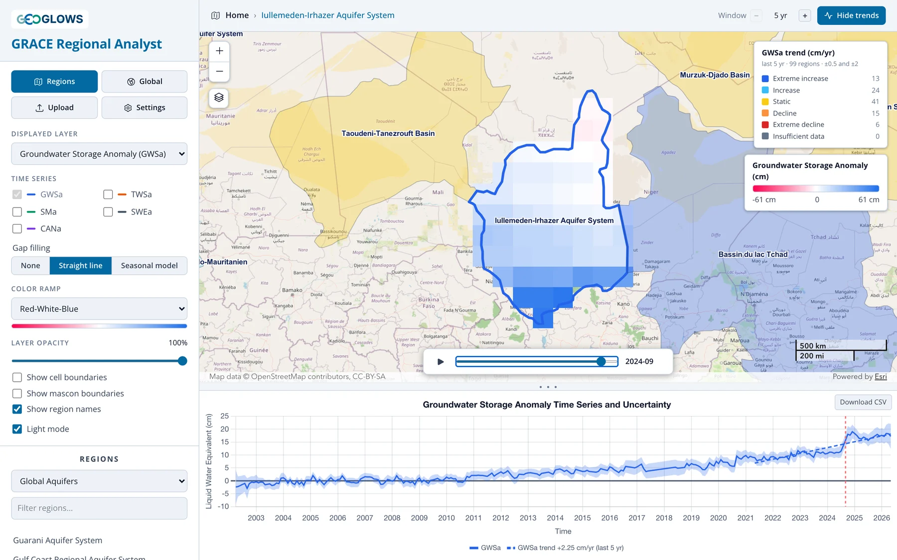

# GRACE Regional Analyst Overview

## Overview

The GRACE Regional Analyst is a web application for tracking how groundwater storage has changed since 2002 in any region of the world. It
combines monthly gravity measurements from NASA's GRACE and GRACE Follow-On satellites with land surface model output from NASA's Global Land
Data Assimilation System (GLDAS), and reports the result as a groundwater storage anomaly: how much more or less water is stored underground in a
given month than the 2004–2009 average, expressed as a depth of liquid water in centimeters.

Most aquifers have too few monitoring wells, or wells with too many gaps, to say with confidence whether storage is rising or falling across the
whole system. GRACE sees every aquifer on Earth, every month, with the same instrument. Its resolution is coarse, about 300 km, so it is suited
to aquifers, basins and countries rather than individual well fields, but at that scale it gives a consistent record of storage change where
little else exists.

The app is free and runs in a web browser at
[apps.geoglows.org/grace-anomalies](https://apps.geoglows.org/grace-anomalies){:target="_blank"}. With it you can:

- animate monthly maps of groundwater, total water, soil moisture, snow and canopy water storage anomalies for the whole globe
- pick an aquifer or river basin from one of five published region sets, upload your own boundary as GeoJSON, or draw one on the map
- plot the area-averaged time series for that region, with its uncertainty band, and compare storage components
- classify regions or grid cells by the trend in storage over the last 5, 10, 15 or 20 years, or the whole record
- download the monthly values for any region or cell as a CSV file for your own analysis

## What this training covers

**Part 1, Background,** explains where the numbers come from:

- [The GRACE Mission](grace-mission.md): how two satellites measure changes in Earth's gravity, and what a monthly water storage anomaly is.
- [Deriving Groundwater Storage](deriving-groundwater.md): how the app separates groundwater from the total using GLDAS, and how the
  uncertainty is estimated.
- [Resolution, Leakage and Small Regions](resolution-and-leakage.md): what GRACE can and cannot resolve, and how to work with regions smaller
  than its footprint.

**Part 2, Using the App,** walks through the interface: [the layout](../app/interface.md), [the regional view](../app/regional-view.md),
[the global view](../app/global-view.md), [trend analysis](../app/trends.md) and
[downloading data](../app/downloading-data.md).

**Part 3, Gap Filling,** covers the gaps in the record and the method behind the **Seasonal model** fill: [the options in the app](../gap-filling/gaps.md),
[the model](../gap-filling/seasonal-model.md),
[how it is fitted](../gap-filling/fitting.md), [how the gaps are filled](../gap-filling/filling.md), and
[how accurate the filled values are](../gap-filling/accuracy.md).

**Part 4, Recharge Analysis,** estimates annual groundwater recharge with the water table fluctuation method: [the method](../recharge/wtf-method.md)
as applied to GRACE data, then [opening the analysis](../recharge/opening.md) and checking the series, [the water years and
picks](../recharge/picks.md), and [the results](../recharge/results.md).

**Part 5, Case Studies,** summarizes three published studies by the Brigham Young University team that developed the app and its
predecessor, the GRACE Groundwater Subsetting Tool (GGST). Each combines the app's GRACE and GLDAS water balance with other data:
[estimating recharge in Niger](../case-studies/niger.md) where wells are scarce, [accounting for a large reservoir in the Volta
Basin](../case-studies/volta.md), and [correcting for leakage in California's Central Valley](../case-studies/central-valley.md), a narrow,
heavily pumped valley.

## History

The GRACE Regional Analyst replaces the GRACE Groundwater Subsetting Tool (GGST), a Tethys Platform app developed at Brigham Young University
under the NASA SERVIR West Africa project (2019–2023) and used in training workshops in West Africa, Jordan and Palestine. The new app keeps
GGST's method for separating groundwater from total water storage and adds trend classification, published aquifer and basin boundaries, and
user-drawn regions. It runs entirely in the browser, reading the processed data directly from cloud storage, so no account or login is needed.

## Further reading

These papers established GRACE as a tool for monitoring groundwater storage in large aquifers:

- Rodell, M., Velicogna, I., and Famiglietti, J. S. (2009). Satellite-based estimates of groundwater depletion in India. *Nature*, 460,
  999–1002. [doi:10.1038/nature08238](https://doi.org/10.1038/nature08238){:target="_blank"}
- Famiglietti, J. S., et al. (2011). Satellites measure recent rates of groundwater depletion in California's Central Valley. *Geophysical
  Research Letters*, 38, L03403. [doi:10.1029/2010GL046442](https://doi.org/10.1029/2010GL046442){:target="_blank"}
- Famiglietti, J. S. (2014). The global groundwater crisis. *Nature Climate Change*, 4, 945–948.
  [doi:10.1038/nclimate2425](https://doi.org/10.1038/nclimate2425){:target="_blank"}
- Thomas, A. C., Reager, J. T., Famiglietti, J. S., and Rodell, M. (2014). A GRACE-based water storage deficit approach for hydrological
  drought characterization. *Geophysical Research Letters*, 41, 1537–1545.
  [doi:10.1002/2014GL059323](https://doi.org/10.1002/2014GL059323){:target="_blank"}
