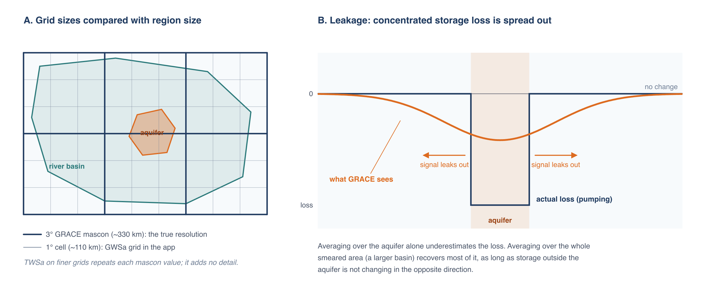
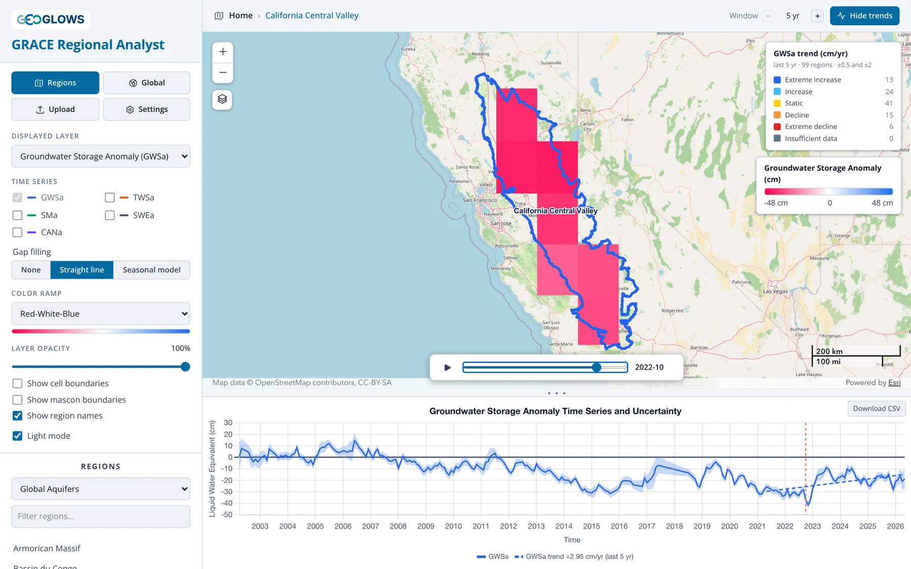

# Resolution, Leakage and Small Regions

## What GRACE can resolve

GRACE senses mass through gravity, and gravity spreads out with distance. From an orbit hundreds of kilometers up, two masses closer together
than a few hundred kilometers blur into one. JPL's mascon solution reflects that limit: it solves for one value per 3° cap, about 330 km across,
and the 0.5° and 1° grids in the app repeat or average those values. They make the data easier to store and map but add no detail.



Panel A compares the grids with two regions. The river basin spans several mascons, so its average draws on several independent measurements.
The aquifer is smaller than one mascon. Its value is mostly whatever the mascon it sits in did, including storage changes outside the aquifer.

As a rule of thumb, GRACE results are reliable for regions of about 200,000 km² or more (roughly 4° × 4° near the equator), usable with care
down to the size of one mascon (about 100,000 km²), and increasingly uncertain below that. GWSa does vary from one 1° cell to the next inside a
mascon, but only because the GLDAS terms vary; the GRACE part of each cell is the mascon value.

## Leakage

Because GRACE blurs mass over a few hundred kilometers, a storage change concentrated in a small area appears in the data as a smaller change
spread over a larger area (panel B). Signal **leaks out** of the region where it happened and into its neighbors. The reverse also happens:
storage changes just outside a region leak in.

Leakage matters most when storage change inside the region differs from storage change around it. Heavy groundwater pumping in an irrigated
valley surrounded by mountains is the worst case: the decline is concentrated in the valley, and GRACE spreads it over the mountains too. An
average over the valley alone then underestimates the true loss, sometimes by a factor of several. Where storage changes similarly inside and
outside the region, as in a large sedimentary basin under a uniform climate, leakage in and out roughly balance and the regional average is
close to the truth.

JPL's coastline filter limits leakage between land and ocean. Leakage between neighboring land areas is not corrected in the app's data.

## Working with small regions

If your region of interest is smaller than a mascon, or is a pumping center surrounded by areas with different behavior, these approaches help:

**Analyze the larger hydrologic unit.** Run the analysis on the river basin or aquifer system that contains your area, using one of the
preset region sets or an uploaded boundary. If nearly all the storage change happens inside the smaller area (for example, if pumping is
concentrated in the aquifer), the volume of change for the larger unit approximates the volume for the smaller area:

```text
ΔV ≈ GWSa_basin × Area_basin
```

This works because a volume summed over a large enough area recovers most of the leaked signal, while an average over a small area doesn't.

**Calibrate against wells.** Where monitoring wells give an independent estimate of storage change over part of the GRACE record, the ratio
between the well-based and GRACE-based estimates gives an empirical scale factor that corrects for leakage in that region. The factor is
specific to the region and the period used to derive it. Stevens et al. (2025) did this for California's Central Valley
([case study](../case-studies/central-valley.md)).

**Interpret a single cell cautiously.** In the global view you can click a single cell to see its time series. That is quick and useful for
exploration, but two neighboring aquifers in the same mascon will show nearly identical results, because they are measured by the same 3° value.



## Other limitations

- **Storage, not levels.** GWSa is a change in the mass of water. Converting it to a change in water table elevation requires a specific yield
  for the aquifer, which varies widely and is often poorly known.
- **No vertical detail.** GRACE can't distinguish shallow from deep aquifers, or confined from unconfined.
- **Model error.** Errors in the GLDAS soil moisture, snow and canopy terms pass directly into GWSa. This is most serious in snowy and wet
  regions, where those terms are large.
- **Surface water.** Changes in reservoirs, lakes and floodplains are counted as groundwater (see
  [Deriving Groundwater Storage](deriving-groundwater.md)).

Even with these limits, GRACE gives a consistent, independent view of storage change across whole aquifer systems, which is often the only such
view available. Use it for regional trends and compare it with local data wherever you can.

## References

- Stevens, M. D., et al. (2025). Groundwater storage loss in the Central Valley analysis using a novel method based on in situ data compared
  to GRACE-derived data. *Environmental Modelling & Software*, 186, 106368.
  [doi:10.1016/j.envsoft.2025.106368](https://doi.org/10.1016/j.envsoft.2025.106368){:target="_blank"}

- Rodell, M., and Famiglietti, J. S. (1999). Detectability of variations in continental water storage from satellite observations of the time
  dependent gravity field. *Water Resources Research*, 35, 2705–2723.
  [doi:10.1029/1999WR900141](https://doi.org/10.1029/1999WR900141){:target="_blank"}
- Longuevergne, L., Scanlon, B. R., and Wilson, C. R. (2010). GRACE hydrological estimates for small basins: Evaluating processing approaches on
  the High Plains Aquifer, USA. *Water Resources Research*, 46, W11517.
  [doi:10.1029/2009WR008564](https://doi.org/10.1029/2009WR008564){:target="_blank"}
