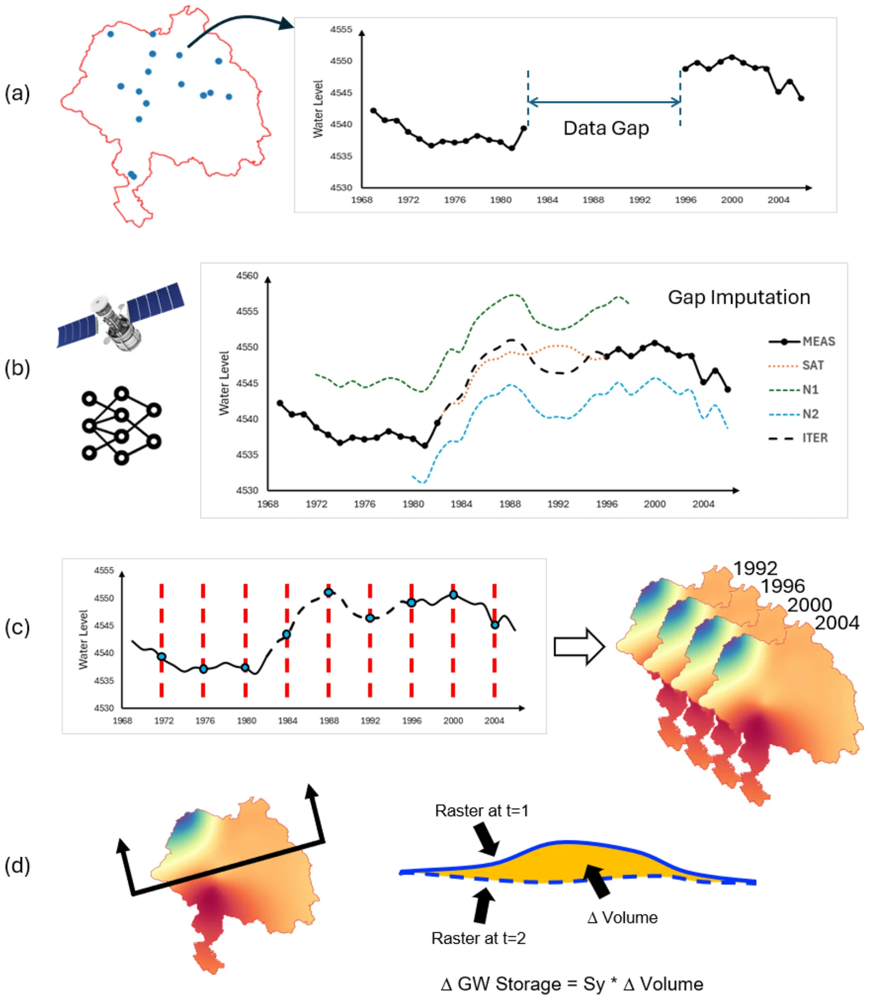
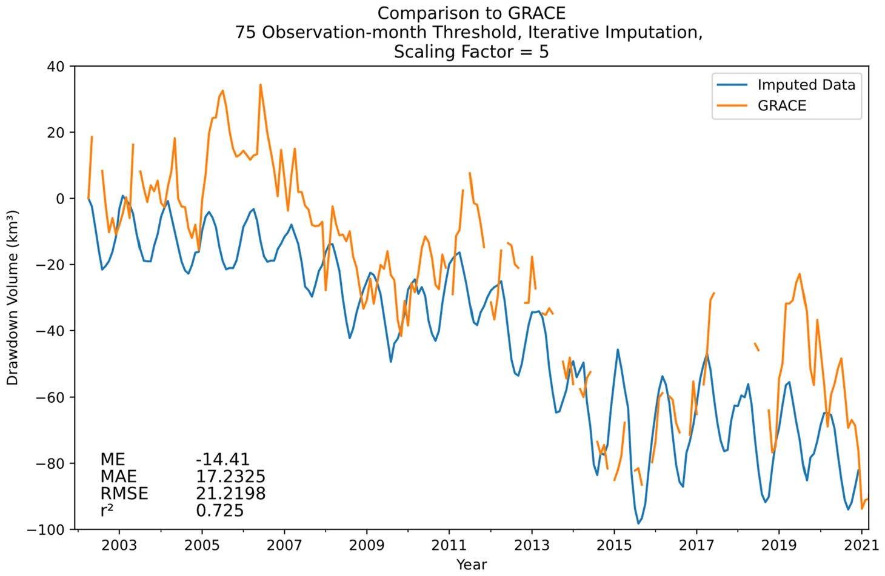

# Valle Central de California: corrección de GRACE con datos de pozos

!!! cite "Artículo"
    Stevens, M. D., Ramirez, S. G., Martin, E.-M. H., Jones, N. L., Williams, G. P., Adams, K. H., Ames, D. P., and Pulla, S. T. (2025).
    **Groundwater storage loss in the Central Valley analysis using a novel method based on in situ data compared to GRACE-derived data.**
    *Environmental Modelling & Software*, 186, 106368.
    [doi:10.1016/j.envsoft.2025.106368](https://doi.org/10.1016/j.envsoft.2025.106368){:target="_blank"}

## Contexto { #setting }

El Valle Central de California mide unos 700 km de largo y 80 km de ancho, unos 52,000 km², y es uno de los sistemas acuíferos con más bombeo del
mundo. Es más angosto que un solo mascon de GRACE de 3° (unos 333 × 264 km a esa latitud), y el descenso por bombeo se concentra en el valle
mientras las montañas circundantes se comportan de otra manera. Eso lo convierte en un caso típico de [fuga de señal](../background/resolution-and-leakage.md#leakage):
promediado sobre el valle, GRACE subestima la pérdida de almacenamiento.

## Una estimación independiente a partir de pozos { #an-independent-estimate-from-wells }

El estudio construyó un registro de almacenamiento a partir de datos de pozos para 1960–2020:

*Análisis del almacenamiento de agua subterránea con datos in situ. (a) se identifican los pozos con vacíos en los datos, (b) los vacíos se imputan con un algoritmo de aprendizaje
automático de varios pasos que incorpora observaciones de la Tierra, (c) se usa interpolación temporal y luego espacial para generar rásteres de nivel de agua
variables en el tiempo, (d) los rásteres de nivel de agua se combinan con coeficientes de almacenamiento para estimar el cambio de almacenamiento de agua subterránea en cada intervalo de tiempo.
Reproducido de Stevens et al. (2025), Fig. 3, © 2025 Elsevier, reutilizado bajo los derechos de los autores.*

1. Los pozos de las bases de datos del USGS y del California Department of Water Resources se filtraron por longitud de registro; el estudio comparó umbrales de
   150, 75 y 50 meses con observaciones (181, 572 y 921 pozos).
2. Los vacíos del registro de cada pozo se rellenaron en dos pasos: un modelo de aprendizaje automático (una máquina de aprendizaje extremo) alimentado por el Índice de Severidad
   de Sequía de Palmer y la humedad del suelo de GLDAS, y luego un refinamiento iterativo con los tres pozos vecinos mejor correlacionados.
3. Los registros rellenados se interpolaron por kriging en superficies mensuales de nivel de agua sobre una cuadrícula de 0.1°.
4. Los cambios de nivel de agua se convirtieron en cambios de almacenamiento con el mapa de rendimiento específico del USGS Central Valley Hydrologic Model (CVHM).

Con el umbral de 75 meses, la curva de almacenamiento basada en pozos coincidió estrechamente con el CVHM (r² = 0.87, RMSE 9.04 km³).

## Calibración de GRACE { #calibrating-grace }

La GWSa de GRACE para el valle, convertida a volumen, siguió la curva basada en pozos en su temporalidad pero fue mucho menor. Multiplicarla por un factor de escala
corrigió la fuga de señal. El mejor factor fue de alrededor de 5 (± 1.0); con él, GRACE y los pozos concordaron con r² = 0.725, un error medio de −14.4 km³
y un RMSE de 21.2 km³ en 2002–2021.

*Comparación de la imputación iterativa de pozos con GRACE usando el conjunto de datos con umbral de 75 meses de observación. Reproducido de Stevens et al. (2025), Fig. 11,
© 2025 Elsevier, reutilizado bajo los derechos de los autores.*

Con el factor aplicado, las pérdidas de almacenamiento de GRACE concuerdan con la mayoría de las estimaciones publicadas para los mismos periodos:

| Estudio publicado | Periodo | Pérdida publicada | GRACE × 5 en este estudio |
|---|---|---|---|
| Famiglietti et al. (2011) | oct 2003 – mar 2010 | 20.3 km³ | 26.7 km³ |
| Scanlon et al. (2012) | oct 2006 – mar 2010 | 31 km³ | 31.1 km³ |
| Xiao et al. (2017) | abr 2002 – sep 2016 | 64.6 km³ | 70.7 km³ |
| Ojha et al. (2018) | dic 2006 – ene 2010 | 21.3 km³ | 53.2 km³ |

## Conclusiones { #conclusions }

- Los registros de pozos con vacíos rellenados pueden producir una historia de almacenamiento que concuerda con un modelo regional calibrado de agua subterránea.
- Esa historia da una forma directa de calibrar un factor de escala de fuga de señal para GRACE, de alrededor de 5 para el Valle Central.
- Una vez calibrado, GRACE puede seguir el cambio de almacenamiento en el valle en adelante, y el mismo enfoque podría usarse en regiones con pocos datos que tengan
  algunos registros de pozos.

**Para usuarios de la aplicación:** en un acuífero pequeño o angosto, el promedio de GRACE de la aplicación capta la temporalidad y la dirección del cambio de almacenamiento, pero puede
subestimar su magnitud varias veces. Un factor de escala calibrado con pozos corrige eso, solo para ese acuífero.
