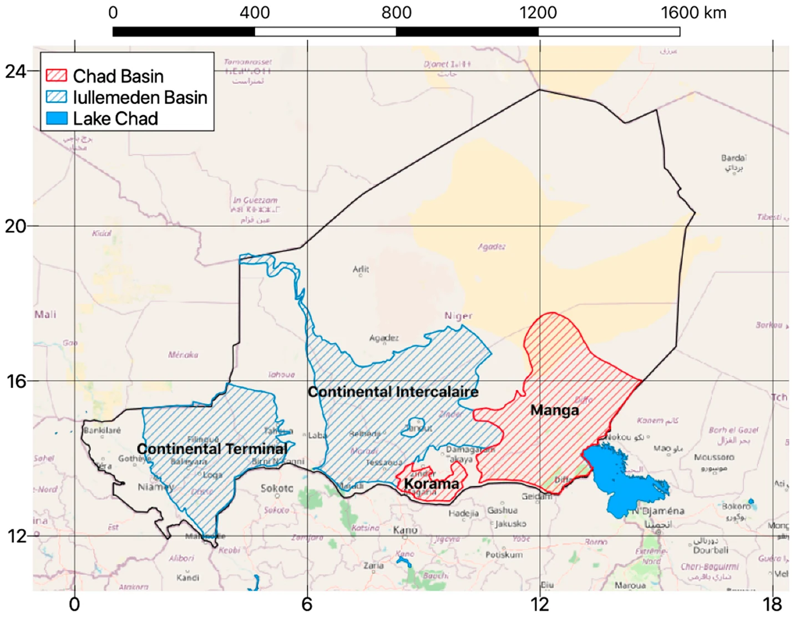
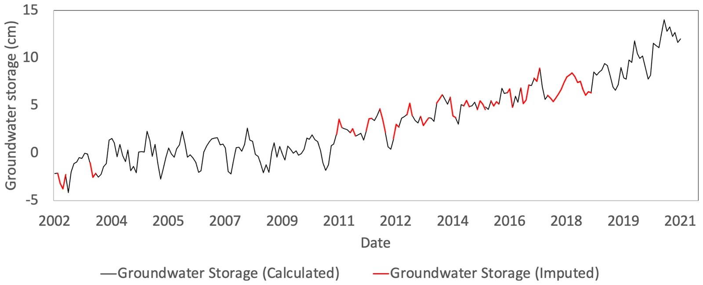
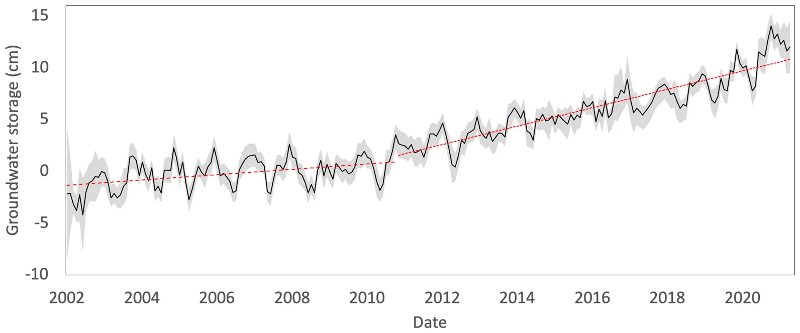
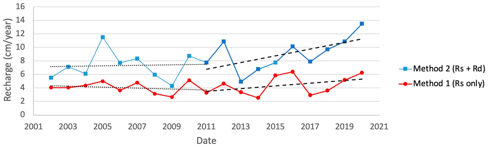

# Niger: storage change and recharge in the Iullemeden and Chad Basins

!!! cite "Paper"
    Barbosa, S. A., Pulla, S. T., Williams, G. P., Jones, N. L., Mamane, B., and Sanchez, J. L. (2022). **Evaluating groundwater storage change
    and recharge using GRACE data: A case study of aquifers in Niger, West Africa.** *Remote Sensing*, 14(7), 1532.
    [doi:10.3390/rs14071532](https://doi.org/10.3390/rs14071532){:target="_blank"}

The study was carried out under the NASA SERVIR West Africa project with the AGRHYMET Regional Centre in Niamey. It follows the same workflow as
the app: derive GWSa for each aquifer, fill the gaps in the record, and estimate annual recharge with the water table fluctuation method.

## Setting and data

Southern Niger overlies two large sedimentary basins. The Iullemeden Basin in the west covers about 620,000 km² and receives 550–650 mm of rain a
year; the study analyzed its Continental Intercalaire and Continental Terminal aquifers. The Lake Chad Basin in the east covers about
2.5 million km² and receives 200–400 mm a year; the study analyzed its Manga and Korama aquifers. Nearly all rain falls between June and
September, and monitoring wells are few.

*Selected aquifers of the Iullemeden and Chad basins. Barbosa et al. (2022), Fig. 4, CC BY 4.0.*

GWSa was computed in GGST from JPL mascon TWSa and the mean of the GLDAS Noah, VIC and CLSM models, relative to the 2004–2009 mean, for April
2002 to September 2021. Missing months were filled by seasonal decomposition: each missing value is the trend at that month plus the average
seasonal and residual values for that calendar month.

*Measured (black) and imputed (red) GWSa data showing that visually, the imputed data honor the long-term trend and seasonal variation present
in the data. Barbosa et al. (2022), Fig. 7, CC BY 4.0.*

## Storage change

In the Iullemeden Basin, storage rose slightly from 2002 to 2011 and much faster from 2011 to 2021, reaching a total increase of more than 10 cm
of water. In the Chad Basin, storage declined slightly through 2011 and rose from 2011 to 2020. Rainfall increased over the same period, but the
correlation between storage and rainfall was low (0.2 for Iullemeden and 0.35 for Chad, with a 7-month lag), so the authors suggest that land
use change also contributed.

*Groundwater storage anomalies in the Iullemeden basin region. Barbosa et al. (2022), Fig. 10, CC BY 4.0.*

## Recharge

The authors applied the water table fluctuation method to each year of the filled GWSa record. Method 1 counts only the visible seasonal rise
and gives a lower estimate; Method 2 adds the drainage the rise offset and gives an upper estimate.

*Estimated recharge values in the Iullemeden basins. Barbosa et al. (2022), Fig. 17, CC BY 4.0.*

The paper compared its averages with earlier studies in Niger (its Table 1):

| Source | Region | Method | Period | Recharge (cm/yr) |
|---|---|---|---|---|
| Barbosa et al. (2022) | Iullemeden Basin | WTF, GRACE | 2002–2011 | 4.0–7.3 |
| Barbosa et al. (2022) | Iullemeden Basin | WTF, GRACE | 2012–2021 | 4.5–9.2 |
| Barbosa et al. (2022) | Chad Basin | WTF, GRACE | 2002–2011 | 2.9–5.4 |
| Barbosa et al. (2022) | Chad Basin | WTF, GRACE | 2012–2021 | 4.1–7.6 |
| Bromley et al. (1997) | Southwest Niger | Chloride mass balance | 1992 | 1.3 |
| Leduc et al. (1997) | Southern Niger | WTF, wells | 1991 | 5–6 |
| Leduc et al. (2001); Favreau et al. (2002) | Southwest Niger | Radioisotopes (¹⁴C and ³H) | 1950s–2000s | 0.1–0.5 |
| Leduc et al. (2001) | Southwest Niger | WTF, wells | 1990s–2000s | 2–5 |
| Vouillamoz et al. (2008) | Southwest Niger | WTF, wells | 1990s–2000s | 2–5 |

The ranges for this study run from Method 1 to Method 2. Method 1 falls within the range of earlier water table fluctuation studies; Method 2 is
higher, which the authors consider reasonable for a period when storage was accumulating. Chloride and isotope methods, which integrate over
much longer periods, give lower values.

## Conclusions

- Groundwater storage in both basins has been rising for the past decade, so the aquifers are not being overused and there is room for further
  development, provided storage continues to be monitored.
- Satellite data made this analysis possible where well records are too sparse to do it from the ground.
- Reporting both WTF methods brackets the likely recharge.

To repeat this analysis for any region, set **Gap filling** to **Seasonal model** and open the
[Recharge Analysis](../recharge/opening.md).
