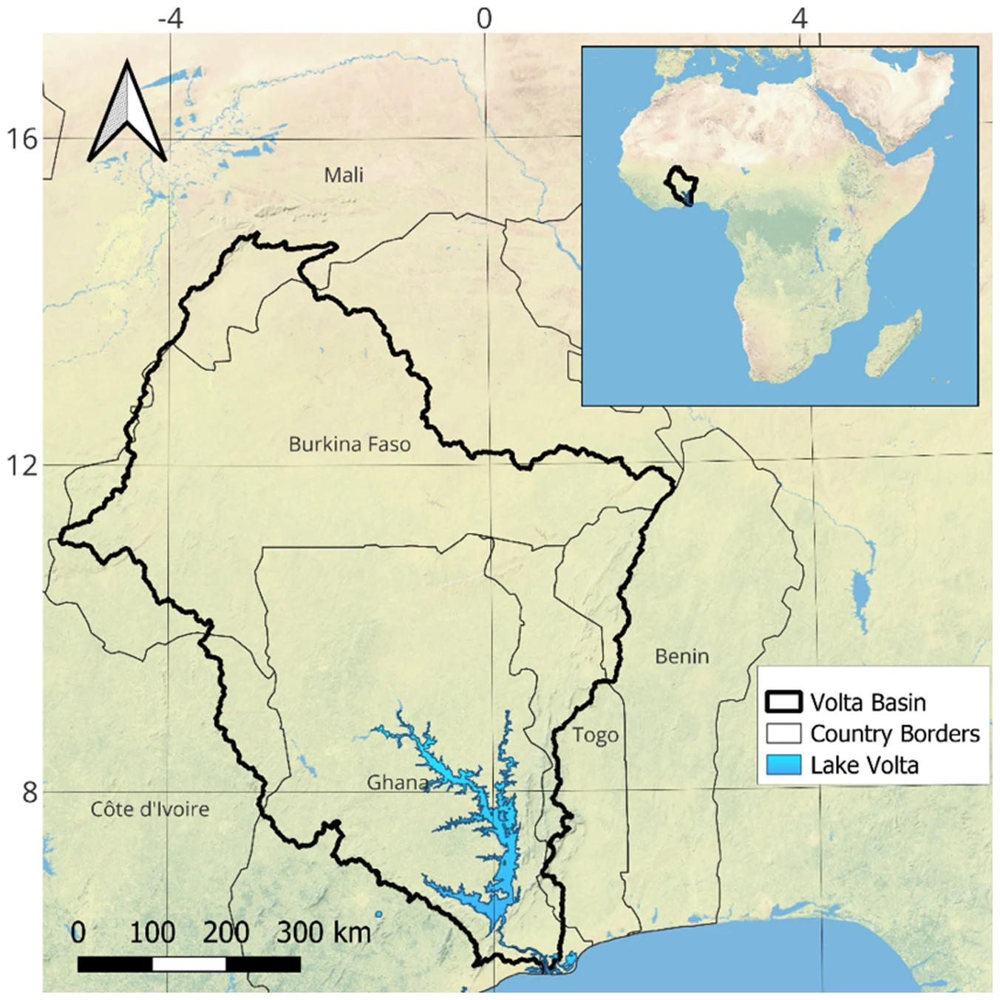
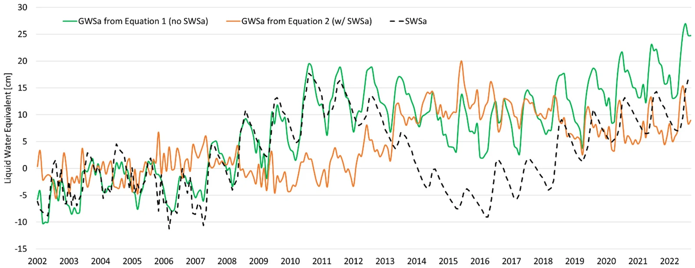
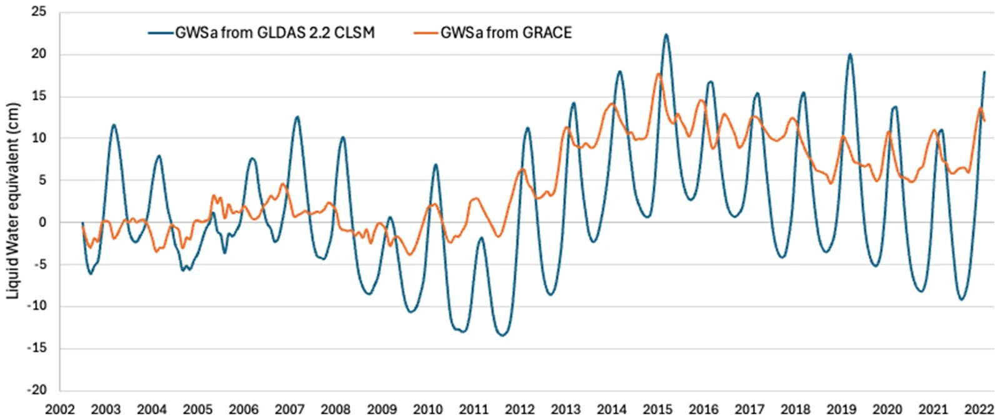
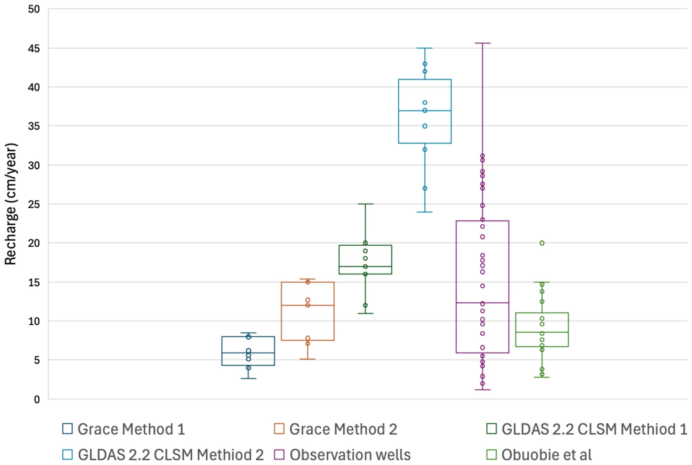

# Volta Basin: separating a large reservoir from groundwater

!!! cite "Paper"
    Barbosa, S. A., Jones, N. L., Williams, G. P., Teklu, H., Yidana, S. M., Pulla, S. T., Sanchez, J. L., Nelson, E. J., Ames, D. P., and
    Miller, A. W. (2025). **A multi-source approach to groundwater storage and recharge assessment in the Volta Basin.** *Science of The Total
    Environment*, 1001, 180421. [doi:10.1016/j.scitotenv.2025.180421](https://doi.org/10.1016/j.scitotenv.2025.180421){:target="_blank"}

## Setting and data

The Volta Basin covers about 400,000 km² in Ghana, Burkina Faso, Togo, Mali, Côte d'Ivoire and Benin. Lake Volta, behind the Akosombo Dam,
covers only about 2% of the basin but holds a large and variable volume of water.



*Volta Basin location. Barbosa et al. (2025), Fig. 1, CC BY 4.0.*

The study used JPL mascon TWSa and the GLDAS 2.1 ensemble for April 2002 to December 2022, the same water balance as the app, and added a
surface water term, SWSa, computed from Copernicus altimetry of Lake Volta:

```text
GWSa = TWSa − (SMa + SWEa + CANa + SWSa)
```

Gaps were filled by seasonal decomposition with a piecewise linear trend, the approach the app uses (see
[Gap-Filling Method](../gap-filling/seasonal-model.md)). The study also compared the results with the groundwater storage computed directly by the GLDAS 2.2
Catchment model, with CHIRPS rainfall, and with 10 monitoring wells in the Nasia sub-basin.

## Why the lake matters

Lake Volta accounts for about half of the basin's total water storage change. Without the lake term, the derived GWSa follows the lake: from
2002 to 2012 it is almost entirely lake water. With the lake removed, groundwater storage changed little until about 2012 and then rose, for a
total gain of about 30 km³, or about 10 cm of water, over 2002–2022.



*Surface water storage anomaly (SWSa) computed from Lake Volta altimetry data and groundwater storage anomaly (GWSa) found with and without
considering SWSa. Barbosa et al. (2025), Fig. 6, CC BY 4.0.*

The app's GWSa for this basin corresponds to the green curve, because the app does not subtract surface water (see
[Deriving Groundwater Storage](../background/deriving-groundwater.md#the-water-balance)).

GLDAS 2.2, which assimilates GRACE, showed the same trend but much larger seasonal swings, so the authors recommend it for trends but not for
recharge estimates.



*Groundwater storage anomaly (GWSa) for Volta Basin derived from the GLDAS 2.2 CLSM model. Barbosa et al. (2025), Fig. 7, CC BY 4.0.*

## Recharge

Applied to the GRACE GWSa for 2010–2020 (the years before 2010 had no clear seasonal cycle), the water table fluctuation method gave average
recharge of 5.8 cm/yr (Method 1) and 10.7 cm/yr (Method 2). Wells in the Nasia sub-basin gave a median of 10.4 cm/yr, assuming a specific
yield of 0.05, and an earlier study by Obuobie et al. (2012) gave 8.6 cm/yr. GLDAS 2.2 gave 17.4 and 36.1 cm/yr, far above the other estimates.



*Boxplot of recharge in the Volta Basin estimated with the WTF Methods 1 and 2 using GRACE data, using the new dataset from GLDAS V2.2, WTF
using observation well data, and from a prior study by Obuobie et al. (2012). Barbosa et al. (2025), Fig. 8, CC BY 4.0.*

## Conclusions

- Groundwater storage in the basin rose by about 30 km³ over 2002–2022, mostly after the early 2010s.
- In a basin with a large reservoir, leaving surface water out of the balance assigns the reservoir's changes to groundwater.
- GRACE-based recharge agrees with well-based estimates and earlier studies, so GRACE can support recharge estimates where monitoring is
  sparse.

**For app users:** before reading GWSa as groundwater in a basin with a large lake, reservoir or wetland, check how much of the storage signal
the surface water accounts for, and remove it if it is large.

To repeat this analysis for any region, set **Gap filling** to **Seasonal model** and open the
[Recharge Analysis](../recharge/opening.md).
