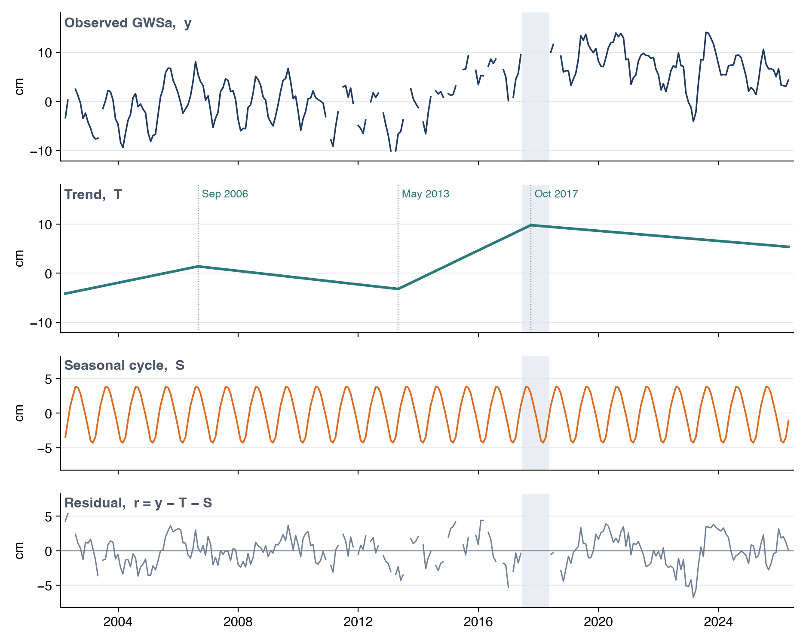
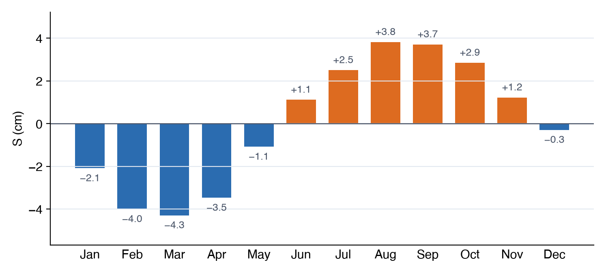
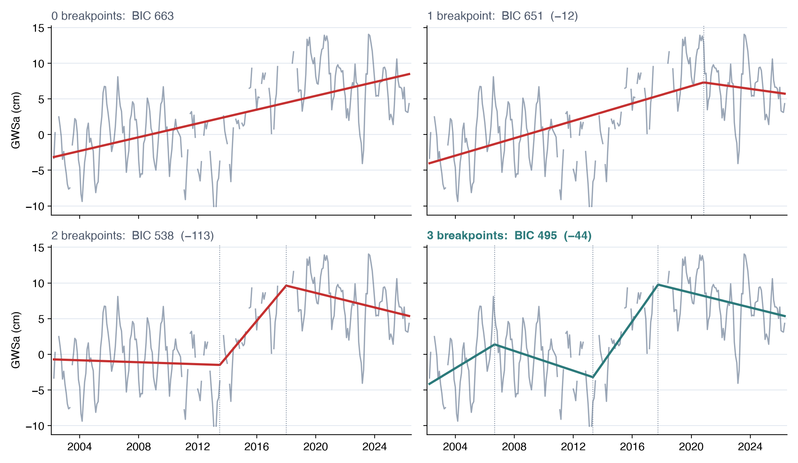
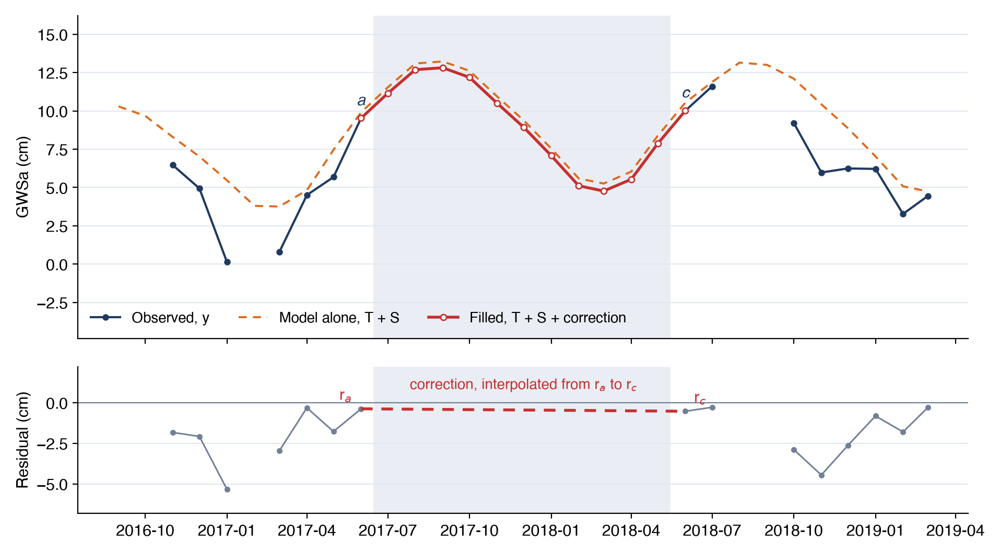
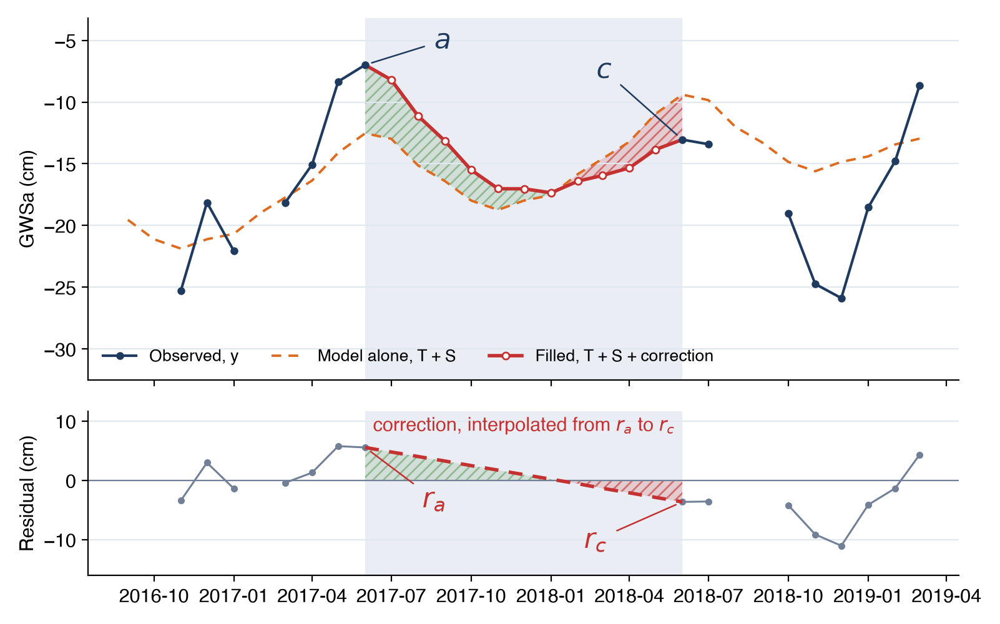

# The Seasonal Model

The **Seasonal model** option estimates each missing month from a model of the region's own record, fitted to its observed months,
following the approach of Barbosa et al. (2022) (see [Gaps in the Record](gaps.md)). This page gives the model, how it is fitted, how the
filled values are computed, and how accurate they are.

## Trend, seasonal cycle and residual

The series is split into a long-term trend, a seasonal cycle that repeats every year, and a residual:

$$
y(t) = T(t) + S(m) + r(t)
$$

where *y*(*t*) is GWSa (or TWSa) in month *t*, *m* is the calendar month of *t* (January to December), *T* is the trend, *S* is the seasonal
cycle and *r* is the residual, the part of each month's value that the trend and the seasonal cycle don't explain.

For the Northern Midwest Aquifer System the model splits GWSa into these three parts, with the gap between the missions shaded:

{ width="800" }

The trend carries the slow rise and fall of storage over the record, the seasonal cycle repeats the same annual swing every year, and the
residual holds what is left: wet and dry years, and noise in the GRACE data.

### The trend

The trend is a continuous piecewise straight line with up to three breakpoints *b*1, …, *b*k, where its slope changes:

$$
T(t) = \beta \, t + \sum_{j=1}^{k} \gamma_j \max(t - b_j,\, 0)
$$

Time *t* is counted in months from the first observed month. Each hinge term max(*t* − *b*j, 0) is zero before its breakpoint and
rises one per month after it, so the slope is *β* before the first breakpoint, *β* + *γ*1 after it, and so on. The line bends at each
breakpoint without jumping. A record with *k* = 0 has a single straight trend.

### The seasonal cycle

The seasonal cycle has one level for each calendar month, *α*Jan, …, *α*Dec. The full model for an observed month *i*
is

$$
y_i = \beta \, t_i + \sum_{j=1}^{k} \gamma_j \max(t_i - b_j,\, 0) + \alpha_{m_i} + \varepsilon_i
$$

The twelve levels also act as the intercept, so there is no separate constant term. The levels are fixed from year to year: the model has one
average annual cycle, and a wet year shows up in the residual rather than in *S*.

For the Northern Midwest Aquifer System the levels, shifted to average zero as described under [Fitting the model](#fitting-the-model),
run from −4.3 cm in March to +3.8 cm in August:

{ width="700" }

## Fitting the model

### Least squares for fixed breakpoints

For a given set of breakpoints, the slopes *β* and *γ*j and the twelve levels *α*m are found by ordinary least squares
over the observed months only. Missing months take no part in the fit. Each calendar month must be observed at least twice, or its level
can't be estimated reliably and the app leaves the series unfilled.

After the fit, the levels are shifted so that the seasonal cycle averages zero over the year, and the trend is shifted up by the same amount:

$$
S(m) = \alpha_m - \bar{\alpha}, \qquad T(t) = \beta \, t + \sum_{j} \gamma_j \max(t - b_j,\, 0) + \bar{\alpha}, \qquad
\bar{\alpha} = \frac{1}{12} \sum_{m} \alpha_m
$$

The sum *T* + *S* is unchanged. With the shift, *T* gives the long-term level and *S* gives each month's departure from it.

### Placing the breakpoints

For a given number of breakpoints *k*, the app chooses their positions to minimize the residual sum of squares (RSS) of the fit. Breakpoints
are limited to keep each part of the trend meaningful:

- at least 48 months (four years) from either end of the record, so an end segment is not fitted to a few months
- at least 36 months (three years) apart, so every segment between two breakpoints spans several seasonal cycles

The search runs in two steps. First, candidate breakpoints are placed every three months, and every valid combination of *k* candidates is
fitted. The combination with the lowest RSS is kept. Then each breakpoint in turn is moved one month earlier or later, and the move is kept
if it lowers the RSS. This repeats until no one-month move improves the fit, so each breakpoint ends up at the best month near the best
three-month candidate.

### Choosing the number of breakpoints

More breakpoints always fit the observed months at least as well, so the number is chosen with the Bayesian information criterion (BIC),
which adds a penalty for each parameter:

$$
\text{BIC} = n \ln\!\left(\frac{\text{RSS}}{n}\right) + p \ln n, \qquad p = 1 + 2k + 12
$$

where *n* is the number of observed months and *p* counts the parameters: the first slope, a slope change and a position for each breakpoint,
and the twelve monthly levels.

The app fits the best model with 0, 1, 2 and 3 breakpoints. Starting from the straight trend, it moves to a model with more breakpoints only if
that model's BIC is at least 10 lower than the BIC of the model chosen so far. A drop of 10 is strong evidence that the extra bend is real
rather than a fit to noise, so the trend bends only where the record clearly changes direction.

For the Northern Midwest Aquifer System each added breakpoint lowers the BIC by more than 10 (by 12, then 113, then 44), so the app keeps
all three:

{ width="800" }

## Filling the gaps

A gap is a run of one or more missing months between two observed months, *a* before it and *c* after it. The model alone, *T* + *S*, would
not meet the observed values at either end of the gap, because each observed month has its own residual. The filled value adds a residual
correction that is interpolated linearly across the gap:

$$
\hat{y}_g = T(t_g) + S(m_g) + r_a + \frac{t_g - t_a}{t_c - t_a}\,(r_c - r_a), \qquad r_a = y_a - T(t_a) - S(m_a), \quad r_c = y_c - T(t_c) - S(m_c)
$$

for each missing month *g* in the gap.

The correction gives the fill a sensible shape whatever the length of the gap:

- For a single missing month, the seasonal change from one month to the next is small, so the filled value is close to a straight line between
  its two neighbors.
- For a long gap, such as the 11 months between the missions, the filled months follow the trend and the seasonal cycle, rising and falling
  with the usual seasons, while the correction shifts them to meet the observed values at both ends.

The two residuals that set the correction come from different months, and nothing ties one to the other. Across the gap between the missions
in the Northern Midwest Aquifer System they happen to be almost the same (−0.38 cm in June 2017 and −0.53 cm in June 2018), so the correction
moves every filled month just under the model alone:

{ width="720" }

In California's Central Valley the same gap starts 5.55 cm above the model and ends 3.64 cm below it. The correction falls by 9.2 cm across
the gap, so the filled months start well above the model alone and finish below it:

{ width="720" }

Observed months are never changed. Months before the first observation or after the last are left empty, because there is no observed value on
the far side to anchor a correction to.

GWSa and TWSa are each filled from their own record, with their own trend and seasonal cycle. A filled GWSa value is therefore not exactly the
filled TWSa minus the GLDAS terms for that month. The GLDAS layers have no gaps and are never filled.

### Example: the Northern Midwest Aquifer System

For the Northern Midwest Aquifer System, the BIC selects three breakpoints, in September 2006, May 2013 and October 2017, which split the record
into four trend segments of +1.3, −0.7, +2.9 and −0.5 cm/yr:

{ width="950" }

The single missing months between 2011 and 2017 sit close to their neighbors. Across the 11-month gap between the missions, the filled values
rise to 12.8 cm in September 2017 and fall to 4.8 cm in March 2018 before meeting the first GRACE-FO month, carrying on the region's annual
cycle. The app shows the same values with **Gap filling** set to **Seasonal model** (see
[Gaps in the Record](gaps.md#the-gap-filling-control)).

## Fill accuracy

The fill was tested on months that do have data. Some observed months are hidden, the model is refitted without them, and the filled values
are compared with the real ones. There are two tests:

- **Single months:** 10% of the observed months (26 months), chosen at random through the record, are hidden together.
- **Long gaps:** an 11-month block is hidden, to mimic the gap between the missions. This is repeated for six blocks spread through the
  record.

Each test compares the seasonal model with two simpler fills: the trend and seasonal cycle without the residual correction, and linear
interpolation between the neighboring observed months. The table gives the root-mean-square error (RMSE) of each, in cm, with the median ±1σ
GRACE uncertainty of the region for comparison:

**Single months** (RMSE, cm):

| Region | ±1σ | Seasonal model | Trend + seasonal | Linear |
|---|---|---|---|---|
| Northern Midwest Aquifer System | 4.4 | 1.3 | 2.4 | 1.1 |
| Volta basin | 3.9 | 1.6 | 2.5 | 2.0 |
| Iullemeden-Irhazer Aquifer System | 1.9 | 0.9 | 1.1 | 0.8 |
| California Central Valley | 3.4 | 3.1 | 5.3 | 3.3 |

**11-month blocks** (RMSE, cm):

| Region | ±1σ | Seasonal model | Trend + seasonal | Linear |
|---|---|---|---|---|
| Northern Midwest Aquifer System | 4.4 | 1.5 | 2.3 | 4.7 |
| Volta basin | 3.9 | 2.6 | 2.4 | 5.1 |
| Iullemeden-Irhazer Aquifer System | 1.9 | 1.4 | 1.4 | 1.7 |
| California Central Valley | 3.4 | 4.2 | 4.8 | 5.2 |

Three results stand out:

- For single months, the seasonal model is about as good as linear interpolation, as expected: across one month, the residual correction makes
  the two nearly the same.
- For 11-month gaps, linear interpolation cuts straight through a whole seasonal cycle, and its error is two to three times that of the
  seasonal model in regions with a strong cycle (4.7 against 1.5 cm for the Northern Midwest).
- In the first three regions the error of the seasonal model is well below the GRACE uncertainty. California's Central Valley fills less
  well, with errors above the uncertainty, because its storage is driven by multi-year droughts and wet years that no average seasonal cycle
  can predict inside a long gap.

The error of a filled value comes from the model rather than from GRACE, so the app doesn't draw the uncertainty band for filled months. In a
region like the Central Valley, treat results that depend on filled months with extra caution, such as recharge for the years the
[Recharge Analysis](../recharge/results.md#the-table) marks as using filled months.

## Reference

Barbosa, S. A., Pulla, S. T., Williams, G. P., Jones, N. L., Mamane, B., and Sanchez, J. L. (2022). Evaluating groundwater storage change and
recharge using GRACE data: A case study of aquifers in Niger, West Africa. *Remote Sensing*, 14(7), 1532.
[doi:10.3390/rs14071532](https://doi.org/10.3390/rs14071532){:target="_blank"}
