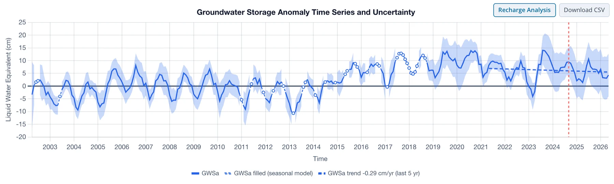
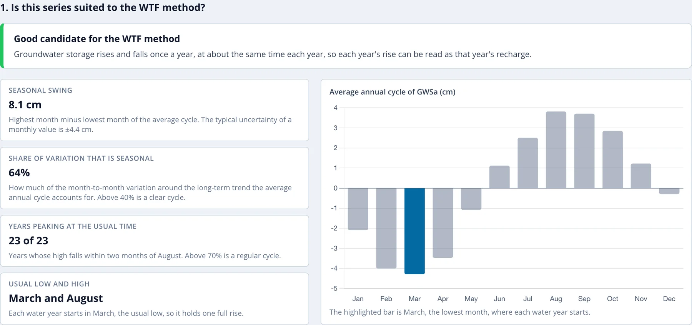

# Opening the Analysis

## The Recharge Analysis button

The Recharge Analysis runs on the filled GWSa series, so it is available only when **Gap filling** in the panel is set to **Seasonal model**
(see [Gap Filling](../app/gap-filling.md)). With that option selected, a **Recharge Analysis** button appears next to **Download CSV** above the
time series chart, for a region and for a single grid cell in the [global view](../app/global-view.md).

The button opens a full-window page for the series in the chart. Its header names the region or cell, and **Back to map** (or the Esc key)
returns to the map. The page has three numbered sections:

1. a check of whether the series suits the WTF method (this page)
2. the water years, with the trough and peak picked in each one (see [Water Years and Picks](picks.md))
3. recharge for each water year, with a chart, a table and a CSV download (see [Results](results.md))

The examples in this section use the Northern Midwest Aquifer System, from the **Global Aquifers** region set: an aquifer under
the upper Mississippi basin with a strong, regular annual cycle. Snowmelt and spring rain recharge it each year, and storage drains from
late summer through winter.

## Is this series suited to the WTF method?

The method reads each water year's rise as that year's recharge, which only makes sense where storage has a clear annual cycle (see
[Where the method applies](wtf-method.md#where-the-method-applies)). The first section tests the series for that cycle before you look at any
recharge numbers.

The verdict at the top is one of three:

| Verdict | Meaning |
|---|---|
| **Good candidate for the WTF method** | Storage rises and falls once a year, at about the same time each year. |
| **Use the results with care** | There is an annual cycle, but it is weak or irregular next to other changes in storage. Check each year's picks and rely on multi-year means. |
| **Poor candidate for the WTF method** | There is little regular annual cycle, and recharge estimates are unlikely to be meaningful. |

Four numbers below it explain the verdict:

- **Seasonal swing**: the highest month minus the lowest month of the average annual cycle, in cm, shown with the median ±1σ uncertainty of a
  monthly GWSa value. A swing that is small next to the uncertainty leaves each year's rise poorly measured.
- **Share of variation that is seasonal**: how much of the month-to-month variation around the long-term trend the average annual cycle
  accounts for. Only observed months count, because filled months come from the same model and would agree with it by construction.
- **Years peaking at the usual time**: the number of complete water years whose highest month (with the trend removed) falls within one month
  of the usual peak.
- **Usual low and high**: the lowest and highest months of the average cycle. Each water year starts in the usual low, so that it holds one
  full rise.

The verdict combines the second and third numbers:

| Verdict | Share seasonal | Years peaking at the usual time |
|---|---|---|
| Good | at least 40% | and at least 70% |
| Poor | below 10% | or below 50% |
| Use with care | anything in between | |

The chart beside the numbers shows the average annual cycle of GWSa, one bar per calendar month, with the lowest month highlighted.

For the Northern Midwest Aquifer System the seasonal swing is 8.1 cm against a typical uncertainty of ±4.4 cm, the annual cycle explains 64% of
the variation, and 21 of 23 water years peak within a month of August. Storage is lowest in March, so each water year runs from March to the
following February.

California's Central Valley gets a different verdict. Its storage does have an annual cycle, but multi-year droughts and wet periods, and the
heavy pumping during droughts, are as large as the seasonal swing:

A **Use the results with care** verdict doesn't stop the analysis. Read the rest of the page with more care: check each year's picks in the
editor, and rely on the multi-year means. With a **Poor candidate** verdict, the yearly rises are mostly noise or multi-year change, and the
recharge numbers should not be used.

If the series is too short, or some calendar month has too few observations to fit the seasonal model, the page says so and shows no results.
