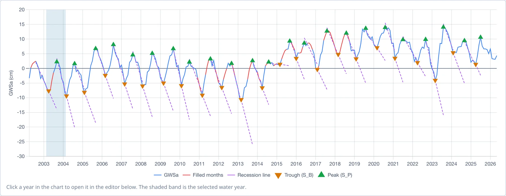
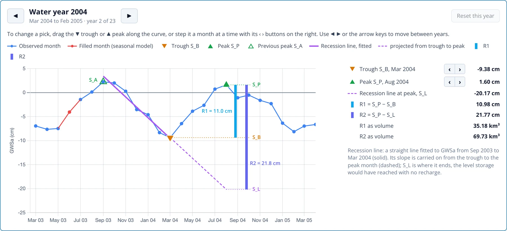

# Années Hydrologiques et Choix des Points

La deuxième section de la page Recharge Analysis découpe la série en années hydrologiques et choisit le creux et le pic de chacune. L'application les choisit
automatiquement, comme décrit dans [La Méthode WTF](wtf-method.md#applying-the-method-to-grace-data). Chaque point choisi peut être vérifié et déplacé
manuellement dans l'éditeur d'année.

## L'année hydrologique { #the-water-year }

**Water year starts in** (début de l'année hydrologique) définit le mois calendaire où commence chaque année hydrologique. Par défaut, c'est le minimum habituel trouvé lors de la
[vérification de saisonnalité](opening.md#is-this-series-suited-to-the-wtf-method), affiché sous la forme « (auto, the usual low) ». Modifiez-le si vous savez que
l'hydrologie de la région appelle un autre début. L'analyse n'utilise que des années hydrologiques complètes ; une année partielle à l'une ou l'autre extrémité de la série est
donc exclue. Les années hydrologiques portent le nom de l'année civile où elles commencent : pour le Northern Midwest Aquifer System, l'année hydrologique 2004 va de mars
2004 à février 2005.

Changer le mois de début déplace toutes les années hydrologiques et efface donc tous les points que vous avez placés manuellement. **Reset all picks** les efface sans changer
le mois de début.

## Le graphique d'ensemble { #the-overview-chart }

Le graphique montre toute la série comblée avec les points choisis pour chaque année :

- la GWSa observée en bleu, et les mois comblés en rouge, de sorte qu'un point placé sur un mois estimé se remarque
- chaque creux (SB) sous forme de ▼ orange et chaque pic (SP) sous forme de ▲ vert
- la droite de récession de chaque année en violet, ajustée du pic précédent jusqu'au creux et prolongée jusqu'au mois du pic

Un coup d'œil sur le graphique montre si les points choisis suivent le cycle : un ▼ au fond de chaque creux et un ▲ au sommet de la remontée suivante.
La bande ombrée indique l'année hydrologique ouverte dans l'éditeur. Cliquez n'importe où dans une autre année pour l'ouvrir.

## L'éditeur d'année { #the-year-editor }

L'éditeur, sous le graphique, montre une année hydrologique en détail, avec les mois qui déterminent sa recharge :

Le graphique commence au creux de l'année précédente ; il montre donc la remontée de l'année précédente jusqu'à SA, la récession de SA jusqu'au
creux de l'année, et la remontée de l'année jusqu'au pic. La légende au-dessus liste chaque repère :

| Repère | Signification |
|---|---|
| Ligne et points bleus | mois observés |
| Ligne et points rouges | mois comblés par le modèle saisonnier |
| ▼ orange, S_B | le creux de l'année |
| ▲ vert, S_P | le pic de l'année |
| △ vert creux, S_A | le pic précédent, où commence la droite de récession |
| Ligne violette continue | la droite de récession, ajustée sur GWSa de S_A jusqu'au creux |
| Ligne violette en tirets | la droite de récession prolongée du creux jusqu'au mois du pic, aboutissant à S_L |
| Barre bleu clair | R1, de S_B jusqu'à S_P |
| Barre violette | R2, de S_L jusqu'à S_P |

Des repères en pointillés reportent SP, SB et SL jusqu'aux barres, ce qui permet de voir quels niveaux couvre chaque estimation. Le
panneau de droite liste le creux et le pic avec leurs mois et valeurs, SL, R1 et R2 en cm et, pour une région, sous forme de volumes en
km³. Une note sous les valeurs indique les mois sur lesquels la droite de récession a été ajustée, ainsi que les notes du tableau pour l'année (voir
[Résultats](results.md#the-table)).

Pour l'année hydrologique 2004, le creux tombe en mars 2004 à −9.38 cm et le pic en août 2004 à 1.60 cm ; R1 vaut donc 10.98 cm. La droite de récession est
ajustée du pic de septembre 2003 (SA) jusqu'au creux de mars. Prolongée jusqu'en août, elle atteint SL = −20.17 cm ; R2 vaut donc
21.77 cm. Sur les 320 368 km² du système aquifère, cela représente de 35.2 km³ (R1) à 69.7 km³ (R2) de recharge.

La première année hydrologique n'a pas de pic précédent. Son SA est le mois le plus haut avant son creux, une fois la tendance à long terme retirée.

### Naviguer entre les années { #moving-through-the-years }

**◀** et **▶**, de part et d'autre du titre de l'année, passent à l'année hydrologique précédente ou suivante, tout comme les touches fléchées ← et →. Le titre indique les
mois couverts par l'année hydrologique et sa position dans la série (« year 2 of 23 »). Cliquer sur une ligne du tableau des résultats ouvre aussi cette année.

### Modifier un point { #changing-a-pick }

Vérifiez le creux et le pic de chaque année. Un point peut être erroné lorsqu'un mois bruité, souvent un pic parasite dans les données GRACE ou un mois comblé, est plus haut ou plus bas
que le véritable point d'inflexion. Il y a deux façons de déplacer un point :

- **Faites glisser** le creux ▼ ou le pic ▲ le long de la courbe. Le marqueur s'aligne sur les mois pendant le glissement, et l'année est recalculée quand vous relâchez.
- **Avancez** d'un mois à la fois avec les boutons **‹** et **›** à côté du creux ou du pic dans le panneau de droite.

Les points sont limités aux mois que la méthode autorise. Le pic reste dans son année hydrologique et après le pic de l'année précédente. Le creux reste entre le pic précédent et le pic de l'année. Un bouton de pas est désactivé lorsque le mois suivant enfreindrait
ces limites.

Déplacer un point recalcule toute l'analyse. Un pic détermine SA pour l'année suivante ; déplacer un pic modifie donc aussi la droite de
récession de l'année suivante, son R2 et éventuellement son creux. Les années comportant un point placé manuellement sont marquées d'un ✎ dans le tableau des résultats et de « set by hand » dans ses notes.
**Reset this year** rétablit les points automatiques pour une année, et **Reset all picks** fait de même pour toutes les années.

Les points placés manuellement sont conservés jusqu'à la fermeture de la page. Pour les garder, téléchargez le CSV, qui enregistre les points et signale ceux placés manuellement.
