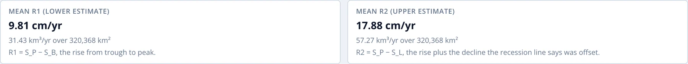
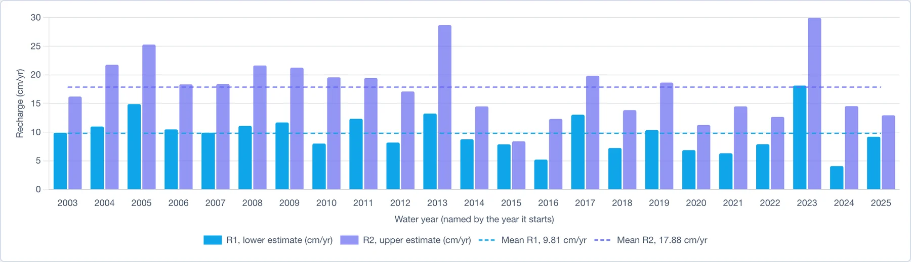
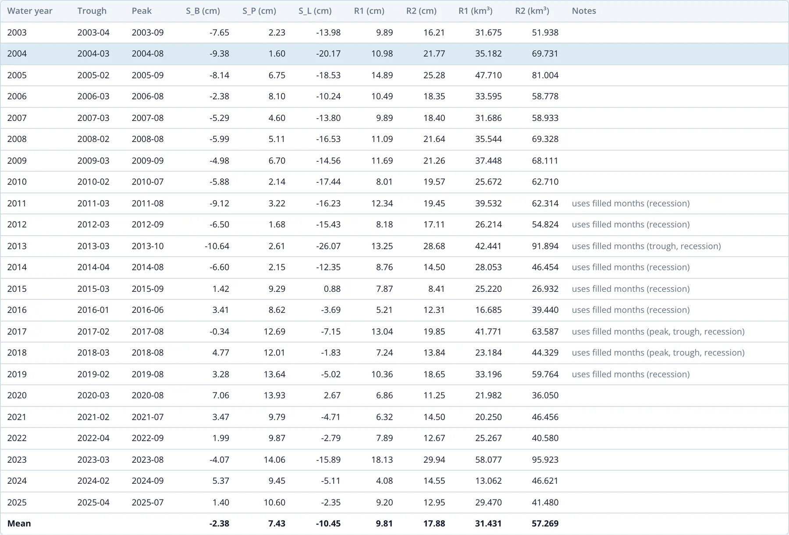

# Results

The third section of the Recharge Analysis page reports recharge for every water year, using the picks from the
[previous section](picks.md). It updates as soon as a pick or the water year start changes.

## Mean recharge

Two cards give the mean of R1 and R2 over all water years, in cm/yr and, for a region or cell, as a volume in km³/yr over its area:

For the Northern Midwest Aquifer System, mean recharge is 9.81 cm/yr (R1) to 17.88 cm/yr (R2), or 31.4 to 57.3 km³/yr over 320,368 km².

## Recharge by water year

The chart shows R1 and R2 for each water year as pairs of bars, with each one's mean as a dashed line:

The chart shows how much recharge varies from year to year. For the Northern Midwest Aquifer System, R1 ranges from 4.1 cm in 2024 to 18.1 cm
in 2023. The gap between each pair of bars is RD, the drainage the recession line adds back, and it is widest in years with a steep
recession, such as 2013.

## The table

The table lists every water year:

| Column | Meaning |
|---|---|
| Water year | named by the calendar year it starts in |
| Trough, Peak | the months of SB and SP, with ✎ when set by hand |
| S_B, S_P, S_L | the trough, the peak and the end of the recession line, in cm |
| R1, R2 | recharge for the year, in cm |
| R1, R2 (km³) | recharge as a volume, for a region or cell |
| Notes | anything to check about the year |

The last row gives the means. Click a row to open that year in the [year editor](picks.md#the-year-editor).

The Notes column flags three things:

- **set by hand**: the trough, the peak or both were moved in the editor.
- **uses filled months**: the peak, the trough or the months the recession line was fitted to include filled months, so the result depends on
  the gap-filling model. For the Northern Midwest Aquifer System this applies to every year from 2011 to 2019, when GRACE was missing scattered
  months and then the 11 months between GRACE and GRACE-FO.
- **long recession extrapolation**: the recession line was carried on for more than twice as many months as it was fitted over, so R2 is less
  reliable than usual.

A year whose picks can't be made, for example a hand-set peak that comes before the previous peak, shows the reason in the Notes column and is
left out of the means.

## Downloading the results

**Download CSV** saves the table as `recharge_<region>.csv`. It has one row per water year and a final row of means:

| Column | Meaning |
|---|---|
| `water_year` | named by the calendar year it starts in |
| `trough`, `peak` | months of SB and SP, as YYYY-MM |
| `S_P_cm`, `S_B_cm`, `S_L_cm` | the peak, trough and end of the recession line |
| `R_S_cm`, `R_D_cm` | the visible rise and the drainage added back |
| `R1_cm`, `R2_cm` | recharge for the year |
| `R1_km3`, `R2_km3` | recharge as a volume (region or cell only) |
| `long_extrapolation` | `true` when R2 relies on a long recession extrapolation |
| `uses_filled_months` | which of `peak`, `trough` and `recession` use filled months |
| `set_by_hand` | which of `peak` and `trough` were set by hand |
| `note` | the reason a year has no result |

## Interpreting the results

- **Report R1 and R2 together.** They bracket the recharge: R1 leaves out the drainage during the rise, and R2 carries the recession line well
  past the months it was fitted to. The true value most likely falls between them.
- **Use multi-year means.** The ±1σ uncertainty of a monthly GWSa value is often as large as a single year's rise: ±4.4 cm against a mean
  R1 of 9.8 cm for the Northern Midwest Aquifer System. A single year's estimate is uncertain, and a mean over ten or more years is much more
  robust.
- **Check years that use filled months.** Results for these years depend on the gap-filling model, especially around the 2017–2018 gap between
  the missions.
- **Pumping is not recharge.** In a heavily pumped aquifer, the dry-season decline includes pumping as well as natural drainage. The recession
  line carries that decline forward, so RD, and with it R2, counts the pumping as recharge. R1 is the safer estimate there.
- **Small regions understate the rise.** GRACE smooths storage changes over a few hundred kilometers, so in a small or narrow region the
  seasonal rise, and with it the recharge, can be understated (see
  [Resolution, Leakage and Small Regions](../background/resolution-and-leakage.md)).
- **Compare with independent estimates.** Well hydrographs, chloride mass balance or published studies for the same aquifer give a check on the
  GRACE numbers. The [Niger](../case-studies/niger.md) and [Volta](../case-studies/volta.md) case studies compare GRACE recharge with well-based estimates.
