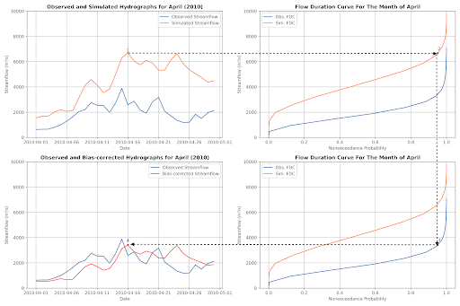

# Retrospective Data & Validation

## Retrospective Data

The retrospective simulation in the GEOGLOWS Model is a deterministic 
dataset with daily resolution, providing historical streamflow data. 
Version 1 of the model covers the period from 1979 to the present, while
Version 2 extends the dataset back to 1940, offering over 84 years of 
historical data. This simulation is based on the ERA5 reanalysis, which 
is updated weekly, ensuring that the lag between real-time and historical 
data remains minimal. The retrospective data is essential for calculating 
return periods, understanding long-term hydrological trends, and placing 
current streamflow forecasts in a historical context.

[Retrospective Data](https://drive.google.com/file/d/147febiNAZhg0XSrFSwjBfKPvO8FLEBdo/view?usp=sharing)

## Return periods, flow duration curves, daily/monthly/annual average flows
In hydrological analysis, return periods are used to estimate the probability of 
extreme events like floods. While the Weibull Distribution is often used to 
calculate return periods based on historical data, it is limited by the length 
of the data series and cannot predict events beyond the observed records. For 
the GEOGLOWS Model, the Gumbel Distribution is applied instead, as it better 
models extreme values and allows for extrapolation, making it possible to 
calculate return periods for events beyond the available data. Additionally, 
Flow Duration Curves (FDCs) are used to represent the percentage of time that 
streamflow is likely to equal or exceed certain flow rates, providing insights 
into the variability of water resources. The model also includes the analysis of
daily seasonality to understand patterns of streamflow throughout the year, 
monthly seasonality to observe changes between months, and annual mean 
discharge to detect long-term trends. These analyses are critical for effective
water resource management, flood forecasting, and understanding hydrological patterns.

[Return Periods](https://drive.google.com/file/d/1skirRgypzaD_6P-sZ2IDZ3tYPEXWaZr1/view?usp=sharing)

To further explore the analysis of return periods, flow duration curves, 
and seasonal averages, we invite you to follow along with our interactive 
demonstration in the provided Google Colab notebook. This hands-on notebook 
will guide you through the process, using real data from the Wabi Uetmal River 
in Ethiopia. You can access and run the notebook directly in your browser:

[Retrospective Demonstration Notebook](https://colab.research.google.com/drive/1zYcKoCN_Ljc1znBP87FthZ1uIeDDGazc?usp=sharing)

### Interactive Learning- Retrospective Simulation
To dive deeper into the analysis of retrospective data, return periods, 
flow duration curves, and seasonal averages, we have prepared an interactive
Google Colab notebook. This notebook provides step-by-step guidance for conducting
these analyses using real-world data from the San Juan River at Rancho La Trinidad 
in Costa Rica. It covers both retrospective data and statistical flow analysis, 
allowing you to engage with the data and methods discussed in this guide:

[Retrospective Google Colab Notebook](https://colab.research.google.com/drive/1mCM3qgGPmOEyV9tGOtfoSwNfR1oFFHq_?usp=sharing)

## Observed Data- Hydroserver

We have collected observed discharge data from gauging stations worldwide, 
spanning diverse hydrological environments across 113 countries. This data 
was sourced through a combination of projects, including NASA GEOGLOWS, 
NASA SERVIR (SERVIR-Hindu Kush Himalaya, SERVIR-Mekong, and SERVIR-Amazonia), 
and the Global Runoff Data Centre (GRDC), along with direct contributions from 
national water resource agencies such as IDEAM (Colombia), ANA (Brazil), INAMHI 
(Ecuador), SENAMHI (Peru), INAMEH (Venezuela), INDRHI (Dominican Republic), BOM 
(Australia), WSC (Canada), and USGS (United States), among others. Each gauging 
station is accompanied by metadata, including Station ID, Station Name, Latitude, 
Longitude, and, in some cases, Stream Name. The station network is connected to 
the stream network through a Reach ID, assigned based on the station's proximity 
to the stream. The data is stored and managed using HydroServer, a platform built 
on the Hydrologic Information System (HIS) for collecting, managing, and sharing 
hydrological time series data. The observed data is accessible via [HydroServer](https://hydroserver.geoglows.org/).

[Hydroserver Presentation](https://drive.google.com/file/d/13QBqi0RuFJqRXi-I25_hEm3RsbOIZFSX/view?usp=sharing)

## Validation Exercises and Results
To validate the GEOGLOWS Model, we selected gauging stations that are connected 
to the GEOGLOWS Model stream network and meet specific criteria. These criteria 
include stations paired with a GEOGLOWS reach ID, stations with at least one year 
of data, and stations with records available after January 1, 1979, which aligns 
with the start date of version 1 of the model. With the release of version 2, 
which extends the retrospective simulation back to January 1, 1940, we are now 
able to include a larger set of stations for validation. The performance of the 
GEOGLOWS retrospective simulation is assessed using the Kling-Gupta Efficiency 
(KGE) metric, which decomposes into three components: bias, variability, and 
correlation. This validation process ensures that the model's simulations are 
consistent with observed streamflow data, providing reliable information for 
water resource management and hydrological studies.

*The three components of the Kling-Gupta efficiency (KGE)—bias,
variability, and correlation—used to evaluate the performance 
of the GEOGLOWS retrospective simulation*

*Kling-Gupta efficiency (KGE) evaluating the performance of GEOGLOWS retrospective simulation*

## Bias Correction
The validation results underscore the importance of ongoing model evaluation
and improvement to enhance the performance of the GEOGLOWS Model. 
Consistently addressing bias, variability, and correlation across 
different regions is crucial for improving the accuracy and reliability
of hydrological simulations. The GEOGLOWS Hydrologic Model exhibits biases 
that can limit its precision, prompting the development of a bias correction approach. 
To correct these systematic biases at instrumented locations, we 
propose the Monthly Flow Duration Curve Quantile-Mapping (MFDC-QM) method. 
This method targets biases related to flow variability and correlation. After 
applying the bias correction, we observed a significant improvement in the 
distribution of bias and variability ratios, with a slight improvement in 
correlation values as well across the stations, resulting in more reliable 
simulations and improved Kling-Gupta Efficiency (KGE) metrics.

*Bias correction methodology*

*The three components of the Kling-Gupta efficiency (KGE)—bias, variability, 
and correlation—used to evaluate the performance of the GEOGLOWS bias-corrected
retrospective simulation*

*Kling-Gupta efficiency (KGE) evaluating the performance of GEOGLOWS bias-corrected retrospective simulation*

[Bias Correction Presentation](https://drive.google.com/file/d/1-EEdEoYKmAD7dgyPqN8fH42xiCcRuDmx/view?usp=sharing)

### Interactive Learning- Bias Correction
To dive deeper into the analysis of bias correction and performance evaluation,
we have prepared an interactive Google Colab notebook. This notebook provides 
step-by-step guidance for conducting these analyses using real-world data from
the Magdalena River at El Banco in Colombia. It covers both bias correction 
and performance evaluation, allowing you to engage with the data and methods 
discussed in this guide: 

[Bias Correction Colab Notebook](https://colab.research.google.com/drive/1lGdk9oQRSPMjrL07Yeqb-i_IKRO7zHqk?usp=sharing)

## SABER (Stream Analysis for Bias Estimation and Reduction)
SABER method is a bias correction tool designed for large hydrologic models like GEOGLOWS,
specifically addressing the issue of model biases in both gauged and ungauged river basins. 
SABER uses flow duration curves (FDC) to compare the observed discharge with the simulated values
from hydrologic models, identifying and correcting biases. For ungauged locations, where direct 
observations are unavailable, SABER uses scalar flow duration curve (SFDC). SABER allow the bias 
correction process to extend to ungauged basins by analyzing similar watershed behaviors based on 
spatial proximity and clustering of flow regimes. This method is particularly useful for regions 
where data scarcity limits traditional calibration, such as in global models like GEOGloWS, ensuring 
more accurate discharge forecasts across large spatial domains​.

SABER works by comparing simulated discharge data to observed values at gauged locations 
to detect high or low biases. It applies machine learning clustering techniques to group 
watersheds with similar flow characteristics, helping to extend bias correction from gauged to 
ungauged basins. SABER's process includes calculating SFDCs for different exceedance probabilities, 
dividing the simulated flows by the corresponding SFDC values, even in regions affected by dams
or reservoirs.

