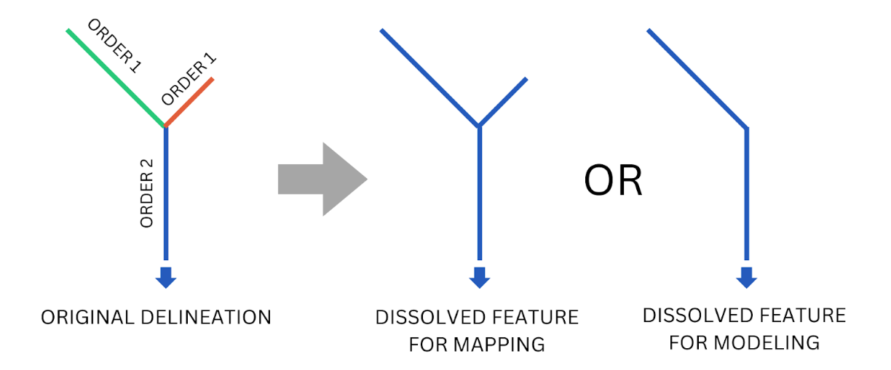

## Términos y Vocabulario

- **Hidrografía**: Conjuntos de datos GIS de características hidrológicas como ríos, puntos de confluencia, límites de cuencas, límites de cuencas hidrográficas, límites de lagos y otras características.
- **Hidrofabricado**: Hidrografía.
- **TanDEM-X**: Misión satelital SAR del Centro Aeroespacial Alemán (DLR) y Airbus Defence and Space. Se utiliza para producir un modelo de elevación digital de 12 metros de resolución, el producto global de mayor precisión de su tipo. No está disponible públicamente, pero los productos derivados Copernicus Glo30 y FABDEM sí lo están.
- **TDX-Hydro**: Conjunto de datos de líneas centrales de ríos y límites de cuencas producido por la Agencia Nacional de Inteligencia Geoespacial (NGA) en 2023. Los ríos se delinearon a partir de datos de elevación TanDEM-X de 12 metros usando TauDEM con un extenso preprocesamiento de elevación y corrección posterior de ubicación de líneas centrales.
- **TauDEM**: Herramienta de análisis de terreno utilizada para delinear ríos y cuencas a partir de datos de elevación.
- **VPU**: Unidad de Procesamiento Vectorial. Grupo de una o más cuencas hidrográficas completas agrupadas para facilitar la distribución, cómputo y elaboración de mapas.
- **River ID**: Identificador único para cada línea central de río en el conjunto de datos de hidrografía RFS. Programas GIS e hidrológicos suelen tener diferentes nombres para este ID. Por ejemplo, TauDEM y TDX-Hydro lo llaman "link number" (LINKNO), y el software de Esri lo llama "common identifier" (COMID). En RFS, se refiere como River ID. Cualquier referencia a LINKNO, COMID, ReachID, StreamID, RiverID u otro similar debe entenderse como lo mismo.
- **Orden de Corriente de Strahler**: Número para clasificar ríos topológicamente. Los ríos más pequeños son de orden 1; cuando dos ríos de orden 1 se encuentran, forman uno de orden 2, y así sucesivamente. En TDX-Hydro, el orden máximo es 9.

---

## Descripción General

La hidroagrafía del RFS (River Forecast System) es una modificación del conjunto de datos de ríos y cuencas TDX-Hydro. Proviene de datos de elevación propietarios de TanDEM-X con una resolución de 12 metros. Puedes descargar el conjunto completo de datos y revisar el documento técnico completo que describe su creación en https://earth-info.nga.mil/ bajo la pestaña "Geosciences". 

El conjunto completo de datos TDX-Hydro contiene aproximadamente 16 millones de segmentos fluviales y cubre todo el globo en 62 secciones que corresponden al nivel 2 de HydroBASINS. Se omitieron 12 regiones que representan islas o áreas de tierra en latitudes altas del norte. Además, se realizaron muchas revisiones para reducir la cantidad de elementos de corriente y optimizar la red para el enrutamiento de canales, reduciendo el número total de ríos a 6.25 millones. Esta versión utilizada en RFS está disponible para que los usuarios la descarguen y la utilicen para sus propios fines. Este conjunto de datos se conoce como hidroagrafía, hidroestructura o red fluvial. Es un conjunto de datos vectoriales con puntos y líneas con coordenadas, no datos de rejilla, e incluye cuatro componentes principales:

- Las **líneas centrales de los ríos** utilizadas en RFS. Cada corriente tiene un ID único de 9 dígitos, denominado reachID, número de enlace (link number) o ID de corriente. Este archivo se llama `streams_{vpu}.gpkg`.

- Los **límites de cuenca** utilizados en RFS. Son los límites alrededor de cada línea central de corriente y representan el área conectada a dicha corriente. Se identifican usando el mismo número de enlace que las líneas centrales. Este archivo se llama `catchments_{vpu}.spatialite`. Cada línea central de corriente corresponde exactamente a un límite de cuenca único.

- Los **puntos de conexión** utilizados en RFS donde se conectan diferentes líneas centrales de corriente. Cada punto tiene un atributo llamado `DSLINKNO`, que representa el número de enlace aguas abajo para cada punto. Tiene otro atributo llamado `USLINKNOs`, que es una lista separada por comas de los números de enlace aguas arriba del punto de conexión (nexo). Este archivo se llama `nexus_{vpu}.gpkg`.

- Las **cuencas de lagos combinadas** utilizadas en RFS para representar la ubicación de los lagos. Las cuencas de corriente que se identificaron mediante análisis GIS como parte de un lago se combinaron para representar los lagos. Por lo tanto, tendrán una forma diferente al límite real del lago basado en las formas de las cuencas de corriente combinadas. Este archivo se llama `lakes_{vpu}.gpkg`.

---

## Modificaciones a TDX-Hydro

Todas las modificaciones realizadas en cada región de TDX-Hydro están registradas en 3 archivos: 1) `processing_options.xlsx`, 2) `tdx_header_numbers.json` y 3) `terminal_node_vpu_list.csv`. El archivo JSON de números de encabezado de TDX mapea cada número de región de TDX-Hydro a un número único de 2 dígitos, siendo el primer dígito el primer dígito del número de la región, y el segundo dígito correspondiendo al índice del orden de clasificación de todas las regiones que comparten el primer dígito. El archivo CSV de nodos terminales de VPU empareja cada nodo terminal (el ID asociado con la salida de una cuenca hidrográfica) con un número de VPU. Un resumen de estos cambios se incluye a continuación.

Las regiones que fueron excluidas incluyen aquellas que están más al norte y algunas de las islas más pequeñas, donde los conjuntos de datos de escorrentía pueden no ser tan precisos y hay una población más escasa o nula. Las versiones futuras podrían reintroducir estas regiones. Además, corregimos errores encontrados en el conjunto de datos de TDX-Hydro que fueron reportados a la NGA para corrección en versiones futuras. Estos errores incluyen:

1. Corrientes que no tienen longitud ni segmentos aguas arriba/abajo, es decir, corrientes donde solo hay dos puntos y ambos puntos están en la misma ubicación. Estas, junto con cualquier cuenca asociada, fueron eliminadas.
2. Corrientes que no tienen longitud con segmentos aguas arriba o abajo. Estas fueron eliminadas junto con cualquier cuenca asociada, y se modificaron los atributos de los segmentos aguas arriba y/o abajo para que se refirieran entre sí y preservaran la conectividad de la red fluvial.
3. Cuencas con un identificador de stock de '0' nunca tuvieron una corriente asociada. Estas fueron eliminadas.

Para la mayoría, pero no todas, las regiones, las corrientes cabeceras fueron disueltas con los segmentos aguas abajo, hasta e incluyendo el segmento aguas abajo con un orden de corriente de Strahler de 2 o 3. Se decidió que las regiones mayormente costeras (Japón, islas del Caribe, Indonesia) eran más sensibles a los cambios en sus redes fluviales, por lo que estas regiones no tuvieron sus cabeceras modificadas. Otras áreas, como el desierto del Sahara, fueron delineadas con la misma resolución que el resto del mundo, a menudo con demasiada resolución. En estas áreas, más características podían fusionarse sin alterar significativamente el enrutamiento de los ríos. Así, las corrientes cabeceras y los ríos aguas abajo se disolvieron en una sola característica junto con sus cuencas asociadas, y se recalcularon atributos relevantes como la longitud y la pendiente. El orden de corriente al cual se disolverían las cabeceras también se eligió en base a estas consideraciones.

Se eliminaron de TDX-Hydro las cuencas pequeñas de hasta 200 kilómetros cuadrados para todas las regiones. Esto se hizo por razones similares a la disolución de las corrientes cabeceras. Las regiones más costeras tuvieron cuencas de entre 25 y 75 kilómetros cuadrados eliminadas. Otras áreas, como el desierto del Sahara o el norte de Canadá, tuvieron cuencas de 200 kilómetros cuadrados eliminadas. En estas regiones más planas, la alta resolución de la delineación crea pequeños "estanque" o colecciones de corrientes que no drenan al océano y no representan ríos en flujo. A menudo tienen colectivamente un área menor a 200 kilómetros cuadrados. Para las regiones menos costeras y más planas/secas, se eliminaron cuencas más grandes.

Las corrientes cabeceras que desembocaban directamente en una corriente con un orden de corriente de Strahler de dos o mayor fueron disueltas con el segmento aguas abajo inmediato para la mayoría, pero no todas, las regiones. La decisión de podar estas corrientes es la misma que la anterior.

---

## VPUs

Los datos GIS están divididos en 125 piezas más pequeñas, llamadas VPUs (Unidades de Cuenca Hidrográfica). Esto facilita la gestión y el acceso a la gran cantidad de datos. Cada VPU representa una o más cuencas hidrográficas completas.

Los límites de las VPUs también están disponibles para su descarga, para ayudar a identificar qué VPU incluye el área de interés de un usuario. Los otros conjuntos de datos GIS deben descargarse según la VPU de interés y se descargan como una VPU completa.

---

## Metadatos Disponibles

Los ríos V2 tienen los siguientes atributos, que provienen del proceso de delineación de TauDEM. Para más explicación de estos atributos, por favor consulta la [Documentación de TauDEM](https://hydrology.usu.edu/taudem/taudem5/help53/StreamReachAndWatershed.html){:target="_blank"}.

| Atributo             | Fuente    | Descripción                                                               |
|----------------------|-----------|---------------------------------------------------------------------------|
| LINKNO               | TDX-Hydro | Un número de ID único global de 9 dígitos para ese río.                   |
| DSLINKNO             | TDX-Hydro | El ID (LINKNO) del río inmediatamente aguas abajo de ese río.            |
| strmOrder            | TDX-Hydro | El orden de corriente de Strahler.                                        |
| USContArea           | TDX-Hydro | El área de drenaje total aguas arriba del punto más aguas arriba.         |
| DSContArea           | TDX-Hydro | El área de drenaje total aguas arriba del punto más aguas abajo.          |
| LengthGeodesicMeters | RFS V2    | Longitud geodésica de los arcos de los ríos en metros.                     |
| TDXHydroRegion       | RFS V2    | El número original del grupo regional de TDX del cual forma parte este río.|
| TopologicalOrder     | RFS V2    | El orden en que ocurren los ríos desde las cabeceras hasta la salida.      |
| Musk_k               | RFS V2    | El parámetro inicial de Muskingum k calculado para el enrutamiento de ríos.|
| Musk_x               | RFS V2    | El parámetro inicial de Muskingum x calculado para el enrutamiento de ríos.|
| TerminalLink         | RFS V2    | El ID de la salida final de la cuenca de este río.                         |
| VPUCode              | RFS V2    | Un número de tres dígitos que representa cuál VPU (Unidad de Cuenca Hidrográfica) incluye este río.|

