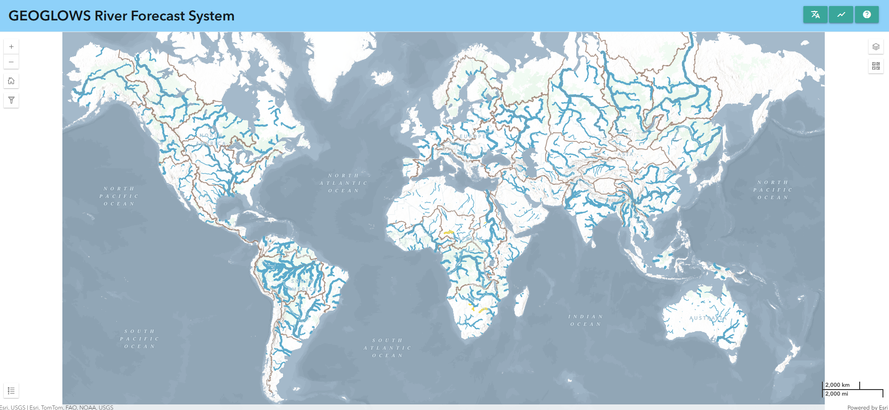
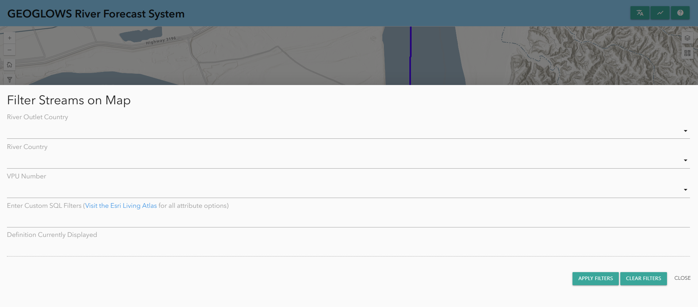

# Usando el RFS Hydroviewer

El RFS Hydroviewer es una herramienta para visualizar y acceder a pronósticos de flujo de ríos y datos históricos a nivel mundial. Esta aplicación basada en la web permite a los usuarios explorar las condiciones de flujo en tiempo real, analizar las tendencias de pronósticos y revisar simulaciones hidrológicas para cualquier río, ayudando a los tomadores de decisiones e investigadores a comprender mejor los desafíos relacionados con el agua. Con herramientas de visualización fáciles de usar, los usuarios pueden evaluar los valores de descarga e identificar posibles riesgos de inundaciones o sequías. El HydroViewer apoya la toma de decisiones informadas en la gestión de recursos hídricos, la reducción de riesgos de desastres y la planificación de la resiliencia climática. Accede a la aplicación en [RFS Hydroviewer](https://hydroviewer.geoglows.org/es/).

## Visualización de Flujos

El Hydroviewer resalta los ríos donde se espera que los flujos superen los periodos de retorno, usando la siguiente leyenda codificada por colores:

Esto permite a los usuarios identificar rápidamente los ríos que están experimentando flujos altos.

**Características del Mapa:**

1. **Niveles de Zoom**:
    - A nivel global, solo se muestran los ríos más grandes.
    - A medida que los usuarios hacen zoom, más ríos se vuelven visibles dentro de su área de interés.
2. **Selección Interactiva de Ríos**:
    - Hacer clic en un río muestra datos retrospectivos y de pronóstico para ese río.
    - El ID del río se muestra para referencia fácil.
3. **Ingreso Directo del ID del Río**:
    - Si se conoce el ID del río, los usuarios pueden ingresarlo directamente en la aplicación para ver los datos.

Los usuarios pueden descargar **gráficos** y archivos **.csv** para los ríos de su interés.

# Selección de Datos

A nivel global, solo se muestran los ríos más grandes. Más ríos se vuelven visibles a medida que el usuario hace zoom en el mapa y en su área de interés. Si no eres lo suficientemente preciso al hacer clic, aparecerá una advertencia pidiéndote que hagas más zoom y seas más preciso al hacer clic en el segmento del río.

Una vez que hayas seleccionado los ríos, aparecerá una ventana emergente con el nombre del río, el ID y dos gráficos: los datos de flujo de agua pronosticados y retrospectivos.

Los gráficos y archivos `.csv` se pueden descargar para los ríos de interés al seleccionar el ícono de la cámara en la esquina del gráfico.

## Datos de Pronóstico Anteriores

De forma predeterminada, cuando haces clic en un río, se mostrarán los pronósticos de 15 días a partir del día actual. Sin embargo, si lo prefieres, puedes ver el pronóstico de un día anterior eligiendo una fecha del menú desplegable de fechas.

## Datos Retrospectivos

De forma predeterminada, se verán 10 años de datos retrospectivos, pero esto se puede ajustar utilizando los deslizadores grises en la parte inferior. Todo el conjunto de datos retrospectivos, que data desde 1940, se puede acceder de esta manera.

## Ingresar un ID de Río

Si un usuario ya conoce el ID del río para su río de interés, puede ingresarlo directamente en la aplicación para ver los datos.

1. Abre la ventana emergente del gráfico ya sea seleccionando el ícono del gráfico en la esquina superior derecha o abriéndola desde una selección anterior de río.
2. Haz clic en **“Ingresar ID de Río”** en la parte superior central de la ventana emergente.
3. Escribe cualquier ID de río (por ejemplo, este ID de alcance es para el río Magdalena en Colombia: `610363879`) y haz clic en **“OK”**.
4. Los datos de pronóstico y retrospectivos se recargarán y se mostrarán para el nuevo río en la ventana emergente.

## Filtrar Datos

Los datos también se pueden filtrar:

- Haz clic en el botón de **filtro** en el lado izquierdo para mostrar las opciones de filtrado.
- Allí, encontrarás opciones para filtrar basadas en:
    - País del río
    - Número de VPU
    - País de salida del río

Esto solo mostrará los ríos que cumplan con estos criterios en el mapa.

