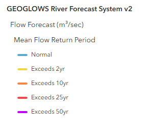

# Using the GEOGLOWS Global HydroViewer

The GEOGLOWS Global HydroViewer is a tool for visualizing and accessing streamflow forecasts and historical data across the globe. This web-based application allows users to explore real-time streamflow conditions, analyze forecast trends, and review hydrological simulations for any river, helping decision-makers and researchers better understand water-related challenges. With easy-to-use visualization tools, users can assess discharge values and identify potential flood or drought risks. The HydroViewer supports informed decision-making in water resource management, disaster risk reduction, and climate resilience planning. Access the app at [GEOGLOWS HydroViewer](https://hydroviewer.geoglows.org/).

## Stream Visualization

The HydroViewer highlights streams where flows are expected to exceed return periods, using the following color-coded legend:

This allows users to quickly identify rivers experiencing high flows.

**Map Features:**  
1. **Zoom Levels**:   
   - At the global level, only the largest streams are displayed.  
   - As users zoom in, more streams become visible within their area of interest.  
2. **Interactive River Selection**:   
   - Clicking on a river displays retrospective and forecast data for that stream.  
   - The river ID is shown for easy reference.  
3. **Direct River ID Entry**:   
   - If the river ID is known, users can directly enter it into the application to view the data.  

Users can download **plots** and **.csv files** for streams of interest.

For detailed instructions on how to use the HydroViewer, refer to the presentation: [GEOGLOWS HydroViewer Tutorial.pptx](https://docs.google.com/presentation/d/1-7BOPZjBse7gyzSRfFiBcQx3quHclUGJ/edit?usp=sharing&ouid=118056077920900718177&rtpof=true&sd=true).
